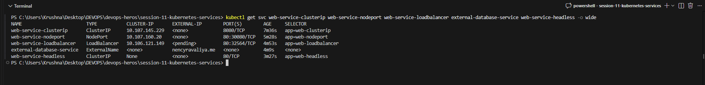

# Session 11 — Kubernetes Services: The Complete Hands-On Lab

> **"Pods come and go, but Services stay forever."**
> This lab covers all 5 Kubernetes Service types, DNS deep-dives, manual Endpoints, and the fundamental difference between Deployments and StatefulSets.

---

## All 5 Service Types at a Glance

The screenshot below shows all 5 Kubernetes Service types deployed simultaneously — notice how each type displays different information in `kubectl get svc`:

| Service Name | Type | ClusterIP | External-IP | Port(s) | What It Means |
|-------------|------|-----------|-------------|---------|---------------|
| `web-service-clusterip` | **ClusterIP** | `10.107.145.229` | `<none>` | `8080/TCP` | Internal VIP, accessible only inside the cluster |
| `web-service-nodeport` | **NodePort** | `10.107.160.20` | `<none>` | `80:30080/TCP` | High port open on every node for external access |
| `web-service-loadbalancer` | **LoadBalancer** | `10.106.121.149` | `<pending>` | `80:32564/TCP` | Cloud LB (pending = tunnel not yet running) |
| `external-database-service` | **ExternalName** | `<none>` | `nencyravaliya.me` | `<none>` | CNAME alias to external FQDN, no IPs involved |
| `web-service-headless` | **ClusterIP (None)** | `None` | `<none>` | `80/TCP` | No VIP — DNS returns individual pod IPs directly |



---

## Table of Contents

| Task | Topic | Screenshot |
|------|-------|------------|
| [Task 1](#task-1--kubernetes-port-architecture) | Port Architecture (the 4 ports) | [01-port-architecture](#screenshot-01) |
| [Task 2](#task-2--clusterip-service-internal-only) | ClusterIP Service | [02-clusterip](#screenshot-02) |
| [Task 3](#task-3--nodeport-service-external-ingress) | NodePort Service | [03-nodeport](#screenshot-03) |
| [Task 4](#task-4--loadbalancer-service--minikube-tunnel) | LoadBalancer + Tunnel | [04-loadbalancer](#screenshot-04) |
| [Task 5](#task-5--externalname-service-cname-alias) | ExternalName Service | [05-externalname](#screenshot-05) |
| [Task 6](#task-6--headless-service-clusterip-none) | Headless Service + StatefulSet | [06-headless](#screenshot-06) |
| [Task 7](#task-7--service-without-selector--manual-endpoints) | No-Selector + Manual Endpoints | [07-manual-endpoints](#screenshot-07) |
| [Task 8](#task-8--fqdn--coredns-deep-dive) | FQDN & CoreDNS | [08-fqdn](#screenshot-08) |
| [Task 9](#task-9--identity-invariance-deployment-vs-statefulset) | Deployment vs StatefulSet Identity | [09-identity](#screenshot-09) |

---

## Prerequisites

```bash
# Start minikube (if not already running)
minikube start

# Verify kubectl is connected
kubectl cluster-info
```

---

## Task 1 — Kubernetes Port Architecture

### Concept

Before touching any YAML, you must understand the **4 ports** involved in Kubernetes Service networking. Getting these confused is the #1 interview mistake.

### The 4 Ports

```
Client Browser
  |
  v       outside the cluster: a host IP is needed
  [nodePort: 30080]   (open on every node, Service field)
  |
  v       inside the cluster: service VIP
  [port: 80]          (Service.spec.ports[].port)
  |
  v       on the destination pod's network
  [targetPort: 80]    (Service routes here; default = port)
  |
  v       inside the container (informational)
  [containerPort: 80] (container's real listen port)
  |
  v
  [nginx process listens on :80 in the container]
```

| Port Name | Where it lives | Who talks to it? |
|-----------|---------------|-----------------|
| **nodePort** | Every worker node host | External world / browser |
| **port** | The Service object | Other pods / internal services |
| **targetPort** | The backend Pod container | The Service routing traffic |
| **containerPort** | Inside Deployment/Pod spec | Purely documentation |

### Command to explore

```bash
kubectl explain service.spec.ports
```

<a name="screenshot-01"></a>
### Screenshot — Port Architecture


---

## Task 2 — ClusterIP Service (Internal Only)

### What is ClusterIP?

`ClusterIP` is the **default** Service type. It allocates a private, stable Virtual IP (VIP) from the cluster subnet (e.g., `10.96.0.0/12`). This VIP is reachable **only from within the cluster**.

### Why do we need it?

Pods are ephemeral — they crash, restart, and get new IPs. ClusterIP gives you a permanent name and IP that sits in front of all matching pods. The frontend talks to `http://web-service-clusterip:8080`, and Kubernetes handles load-balancing across healthy pods automatically.

### Files used

| File | Purpose |
|------|---------|
| `01-clusterip/app-deployment.yaml` | 3-replica nginx Deployment (label: `app: web-clusterip`) |
| `01-clusterip/service.yaml` | ClusterIP Service (port 8080 → targetPort 80) |
| `01-clusterip/client-pod.yaml` | curl test pod for internal access |

### Commands

```bash
# Deploy 3-replica backend + ClusterIP service + curl client
kubectl apply -f 01-clusterip/app-deployment.yaml
kubectl apply -f 01-clusterip/service.yaml
kubectl apply -f 01-clusterip/client-pod.yaml

# Wait for all pods to be ready
kubectl wait --for=condition=ready pod/curl-client --timeout=120s
kubectl wait --for=condition=ready pod -l app=web-clusterip --timeout=120s

# Verify: pod placement
kubectl get pods -l app=web-clusterip -o wide

# Verify: service VIP + port
kubectl get svc web-service-clusterip

# Verify: endpoints auto-bound to all 3 pod IPs
kubectl get endpoints web-service-clusterip

# Internal test #1 — short service name (CoreDNS resolves it)
kubectl exec curl-client -- curl -s http://web-service-clusterip:8080

# Internal test #2 — full FQDN
kubectl exec curl-client -- curl -s http://web-service-clusterip.default.svc.cluster.local:8080
```

### What to expect

- **3 pods** running with individual IPs (e.g., `10.244.1.59`, `10.244.1.60`, `10.244.1.61`)
- **Service** gets a ClusterIP (e.g., `10.108.128.205`) on port `8080/TCP`
- **Endpoints** lists all 3 pod IPs on port 80
- Both curl tests return `<title>Welcome to nginx!</title>`

<a name="screenshot-02"></a>
### Screenshot — ClusterIP VIP + Endpoints + Curl Tests


---

## Task 3 — NodePort Service (External Ingress)

### What is NodePort?

NodePort opens a specific high port (range `30000–32767`) on **every single worker node**. Any request hitting `<Any-Node-IP>:<NodePort>` gets routed to your pods. It also creates a ClusterIP under the hood.

### Files used

| File | Purpose |
|------|---------|
| `02-nodeport/app-deployment.yaml` | 2-replica nginx Deployment (label: `app: web-nodeport`) |
| `02-nodeport/service.yaml` | NodePort Service (port 80 → targetPort 80 → nodePort 30080) |

### Commands

```bash
# Deploy
kubectl apply -f 02-nodeport/app-deployment.yaml
kubectl apply -f 02-nodeport/service.yaml

# Wait for pods
kubectl wait --for=condition=ready pod -l app=web-nodeport --timeout=120s

# Pod placement
kubectl get pods -l app=web-nodeport -o wide

# Service mapping — shows 80:30080/TCP
kubectl get svc web-service-nodeport

# External access — curl from your host machine (outside the cluster)
# Replace <MINIKUBE-IP> with output of: minikube ip
curl http://$(minikube ip):30080
```

### What to expect

- **2 pods** running
- **Service** shows `80:30080/TCP` — NodePort opened on every node
- **curl from host** returns HTTP 200 + `<title>Welcome to nginx!</title>`

<a name="screenshot-03a"></a>
### Screenshot A — Service Mapping (before external curl)


<a name="screenshot-03"></a>
### Screenshot B — External Curl Returns HTTP 200


---

## Task 4 — LoadBalancer Service + minikube tunnel

### What is LoadBalancer?

On a cloud provider (AWS/GCP/Azure), `LoadBalancer` provisions an external cloud load balancer with a public IP. On **minikube**, there is no cloud provider, so we use `minikube tunnel` to emulate one.

LoadBalancer is layered on top: **Cloud LB → NodePort → ClusterIP → Pod**.

### Files used

| File | Purpose |
|------|---------|
| `03-loadbalancer/app-deployment.yaml` | 3-replica nginx Deployment (label: `app: web-loadbalancer`) |
| `03-loadbalancer/service.yaml` | LoadBalancer Service (port 80 → targetPort 80) |

### Commands

```bash
# Apply deployment + service
kubectl apply -f 03-loadbalancer/app-deployment.yaml
kubectl apply -f 03-loadbalancer/service.yaml

# Immediately check — EXTERNAL-IP will show <pending>
kubectl get svc web-service-loadbalancer

# Start the tunnel (run in a SEPARATE terminal, requires admin)
minikube tunnel

# Now check again — EXTERNAL-IP is populated
kubectl get svc web-service-loadbalancer

# Curl the external IP on port 80
curl http://<EXTERNAL-IP>:80

# Verify the layered structure (ClusterIP + NodePort underneath)
kubectl get svc web-service-loadbalancer -o yaml | grep -A5 "spec:"
```

### What to expect

- Immediately after apply: `EXTERNAL-IP = <pending>`
- After `minikube tunnel` starts: EXTERNAL-IP gets a real IP (e.g., `10.96.116.206`)
- Curl returns `<title>Welcome to nginx!</title>`
- The LB internally creates both a ClusterIP and a NodePort

<a name="screenshot-04a"></a>
### Screenshot A — EXTERNAL-IP = \<pending\> (tunnel not yet running)


<a name="screenshot-04"></a>
### Screenshot B — EXTERNAL-IP Populated by Tunnel


---

## Task 5 — ExternalName Service (CNAME Alias)

### What is ExternalName?

ExternalName is the odd one out. It does **NOT** use selectors, does **NOT** allocate an IP, does **NOT** route traffic through kube-proxy, and has **NO** pods behind it. It is purely a **CoreDNS CNAME redirect** — an internal alias pointing to an external FQDN.

### Files used

| File | Purpose |
|------|---------|
| `04-externalname/service.yaml` | ExternalName Service (externalName: `krushnaS.me`) |
| `04-externalname/client-pod.yaml` | curl/dns test pod |

### Commands

```bash
# Apply
kubectl apply -f 04-externalname/service.yaml
kubectl apply -f 04-externalname/client-pod.yaml

# Wait for pod
kubectl wait --for=condition=ready pod/dns-test-client --timeout=120s

# Check the service — notice: CLUSTER-IP = <none>, EXTERNAL-IP = target FQDN
kubectl get svc external-database-service

# No endpoints exist (no selector, no pods behind it)
kubectl get endpoints external-database-service

# DNS resolution proves CoreDNS returns a CNAME
# (run inside the test pod)
kubectl exec dns-test-client -- nslookup external-database-service.default.svc.cluster.local
```

### What to expect

- Service type is `ExternalName`, CLUSTER-IP is `<none>`, EXTERNAL-IP is the target FQDN
- `kubectl get endpoints` shows error/not found (no pods to route to)
- DNS lookup shows: `canonical name = krushnaS.me` (CNAME record)
- Outbound traffic through the alias works (HTTP response from the external target)

<a name="screenshot-05a"></a>
### Screenshot A — Service Created + No Endpoints + CNAME Proof


<a name="screenshot-05"></a>
### Screenshot B — Full CNAME Resolution + Outbound Traffic


---

## Task 6 — Headless Service (clusterIP: None)

### What is a Headless Service?

A Headless Service is created by setting `clusterIP: None`. It tells Kubernetes: **"Do NOT assign a VIP. Just give me the direct IP addresses of all healthy backend pods via DNS."**

When paired with a **StatefulSet**, each pod gets its own predictable DNS record:
```
<pod-name>.<service-name>.<namespace>.svc.cluster.local
```

### Files used

| File | Purpose |
|------|---------|
| `05-headless/app-statefulset.yaml` | 3-replica StatefulSet (web-stateful-0/1/2) |
| `05-headless/service.yaml` | Headless Service (`clusterIP: None`) |
| `05-headless/client-pod.yaml` | DNS test client pod |

### Commands

```bash
# Apply StatefulSet + headless service + client
kubectl apply -f 05-headless/app-statefulset.yaml
kubectl apply -f 05-headless/service.yaml
kubectl apply -f 05-headless/client-pod.yaml

# Wait for rollout
kubectl rollout status statefulset/web-stateful --timeout=180s

# Show StatefulSet pods — deterministic ordinals (0, 1, 2)
kubectl get sts web-stateful
kubectl get pods -l app=web-headless -o wide

# Service has CLUSTER-IP = None
kubectl get svc web-service-headless

# CoreDNS returns ALL pod IPs (multiple A records, no single VIP)
kubectl exec headless-dns-client -- nslookup web-service-headless

# Direct ordinal pod addressing
kubectl exec headless-dns-client -- nslookup web-stateful-0.web-service-headless

# Curl via short name works
kubectl exec headless-dns-client -- curl -s http://web-service-headless:80
```

### What to expect

- StatefulSet pods: `web-stateful-0`, `web-stateful-1`, `web-stateful-2` (deterministic names)
- Service: `CLUSTER-IP = None`
- DNS returns **all 3 pod IPs** as separate A records (no single VIP)
- Ordinal addressing: `web-stateful-0.web-service-headless.default.svc.cluster.local` → pod IP
- Curl returns `<title>Welcome to nginx!</title>`

<a name="screenshot-06a"></a>
### Screenshot A — StatefulSet Pods + Headless Service + DNS A Records


<a name="screenshot-06"></a>
### Screenshot B — Ordinal Pod Addressing + Curl Test


---

## Task 7 — Service Without Selector + Manual Endpoints

### Concept

You can create a Kubernetes Service **without a `selector`**. When you do, Kubernetes does NOT auto-create an `Endpoints` object. You manually create and control it yourself.

This is the standard pattern for routing cluster traffic to **external infrastructure** (e.g., an on-premise MySQL database at `192.168.1.150:3306`).

### The two-step pattern

1. **Create a Service with NO selector** → Kubernetes gives it a VIP but no endpoints
2. **Manually create an Endpoints object** with the same name → binds the VIP to external IPs

### Commands

```bash
# Step 1: Create a ClusterIP service with NO selector
kubectl apply -f - <<EOF
apiVersion: v1
kind: Service
metadata:
  name: external-legacy-db
spec:
  type: ClusterIP
  ports:
    - port: 3306
      targetPort: 3306
      protocol: TCP
EOF

# Verify: service gets a VIP, but endpoints are empty
kubectl get svc external-legacy-db
kubectl get endpoints external-legacy-db

# Step 2: Manually attach an Endpoints object pointing at external infra
kubectl apply -f - <<EOF
apiVersion: v1
kind: Endpoints
metadata:
  name: external-legacy-db
subsets:
  - addresses:
      - ip: 192.168.1.150
    ports:
      - port: 3306
        protocol: TCP
EOF

# Verify: endpoints now bound to external IP
kubectl get endpoints external-legacy-db
```

### What to expect

- **Before**: Service has a VIP, but `ENDPOINTS = <none>` (nothing to route to)
- **After**: `ENDPOINTS = 192.168.1.150:3306` — cluster pods can now reach `VIP:3306 → 192.168.1.150:3306`

<a name="screenshot-07a"></a>
### Screenshot A — Service Created, Endpoints Empty


<a name="screenshot-07"></a>
### Screenshot B — Manual Endpoints Bound to External IP


---

## Task 8 — FQDN & CoreDNS Deep Dive

### Concept

Every pod in Kubernetes gets a `/etc/resolv.conf` injected by kubelet. This file tells the pod:
- **Which DNS server to use** (CoreDNS at `10.96.0.10`)
- **Which search domains to try** (so short names auto-expand)
- **ndots:5** — if a name has fewer than 5 dots, try search suffixes first

### The FQDN format

```
<service-name>.<namespace>.svc.cluster.local
```

| Segment | Meaning |
|---------|---------|
| `web-service-clusterip` | Service name |
| `default` | Namespace |
| `svc` | Resource type |
| `cluster.local` | Cluster domain |

### Commands

```bash
# Show CoreDNS pods serving the cluster
kubectl get pods -n kube-system -l k8s-app=kube-dns -o wide

# Show /etc/resolv.conf inside a pod (search list + ndots:5)
kubectl exec curl-client -- cat /etc/resolv.conf

# Short name works because search expands it:
# curl http://web-service-clusterip
# → CoreDNS tries: web-service-clusterip.default.svc.cluster.local → Found!
kubectl exec curl-client -- nslookup web-service-clusterip

# External DNS — CoreDNS forwards unknown domains to upstream
kubectl exec curl-client -- nslookup api.github.com
```

### What to expect

- **CoreDNS** running in `kube-system` namespace (IP: `10.96.0.10`)
- **resolv.conf** shows: `nameserver 10.96.0.10`, `search default.svc.cluster.local svc.cluster.local cluster.local`, `options ndots:5`
- Short name resolves: `web-service-clusterip.default.svc.cluster.local` → ClusterIP
- External query: `api.github.com` traverses search paths first, then resolves externally

<a name="screenshot-08a"></a>
### Screenshot A — CoreDNS Pods + resolv.conf + DNS Resolution


<a name="screenshot-08"></a>
### Screenshot B — resolv.conf + External DNS Traversal


---

## Task 9 — Identity Invariance: Deployment vs StatefulSet

### Concept

This is the key difference between **Deployments** and **StatefulSets**:

| Behavior | Deployment | StatefulSet |
|----------|-----------|-------------|
| Pod names | Random hash: `web-app-84985946cb-bg4pg` | Deterministic ordinal: `web-stateful-0` |
| After delete | Spawns a **brand-new** random hash | Resurrects the **identical** ordinal name |
| Use case | Stateless apps (web servers, APIs) | Stateful apps (databases, Kafka, ZooKeeper) |

### Commands

```bash
# Show Deployment pods — random replica-hash names
kubectl get pods -l app=web-clusterip --no-headers

# Show StatefulSet pods — deterministic ordinals 0, 1, 2
kubectl get pods -l app=web-headless --no-headers

# Delete one Deployment pod
DEPLOY_POD=$(kubectl get pods -l app=web-clusterip -o jsonpath='{.items[0].metadata.name}')
kubectl delete pod $DEPLOY_POD

# Delete the StatefulSet pod
kubectl delete pod web-stateful-0

# Wait for controllers to react
sleep 10

# Check again — Deployment got a NEW random hash, StatefulSet got the SAME name back
kubectl get pods -l app=web-clusterip --no-headers
kubectl get pods -l app=web-headless --no-headers
```

### What to expect

- **Before delete**: Deployment pods have random hashes (`-bg4pg`, `-tdxvm`, `-xfbkd`), StatefulSet pods have ordinals (`-0`, `-1`, `-2`)
- **After delete + respawn**:
  - Deployment: a **brand-new** random hash appears (e.g., `-f4c69` replacing `-bg4pg`)
  - StatefulSet: `web-stateful-0` comes back with the **exact same name**
- This proves StatefulSet pods have **stable, persistent identity** — critical for stateful systems

<a name="screenshot-09a"></a>
### Screenshot A — Before Delete (both pod types side by side)


<a name="screenshot-09"></a>
### Screenshot B — After Delete (Deployment gets new hash, StatefulSet gets same name)


---

## Quick Reference: All 5 Service Types

| Type | ClusterIP | External Access | DNS Record | Use Case |
|------|-----------|----------------|------------|----------|
| **ClusterIP** | Yes (VIP) | No (internal only) | Single A record | Microservice-to-microservice |
| **NodePort** | Yes | Yes (`NodeIP:30080`) | Single A record | Dev/testing, bare-metal |
| **LoadBalancer** | Yes | Yes (cloud LB IP) | Single A record | Production web traffic |
| **ExternalName** | No | N/A (CNAME alias) | CNAME record | External DBs, SaaS APIs |
| **Headless** | None | No (direct pod IPs) | Multiple A records | StatefulSets, peer-to-peer |

---

## Cleanup

```bash
# Task 2
kubectl delete -f 01-clusterip/client-pod.yaml
kubectl delete -f 01-clusterip/service.yaml
kubectl delete -f 01-clusterip/app-deployment.yaml

# Task 3
kubectl delete -f 02-nodeport/service.yaml
kubectl delete -f 02-nodeport/app-deployment.yaml

# Task 4
kubectl delete -f 03-loadbalancer/service.yaml
kubectl delete -f 03-loadbalancer/app-deployment.yaml

# Task 5
kubectl delete -f 04-externalname/client-pod.yaml
kubectl delete -f 04-externalname/service.yaml

# Task 6
kubectl delete -f 05-headless/client-pod.yaml
kubectl delete -f 05-headless/service.yaml
kubectl delete -f 05-headless/app-statefulset.yaml

# Task 7
kubectl delete svc external-legacy-db
```

---

## Lab Runner Script

To generate all screenshot-ready output files automatically:

```powershell
cd K:\Classes\DEV-OPS\devops-heros\session-11-kubernetes-services
.\run-lab.ps1
```

This creates 17 `.txt` files in `screenshots/` — open each one, take a screenshot, and you're done.
