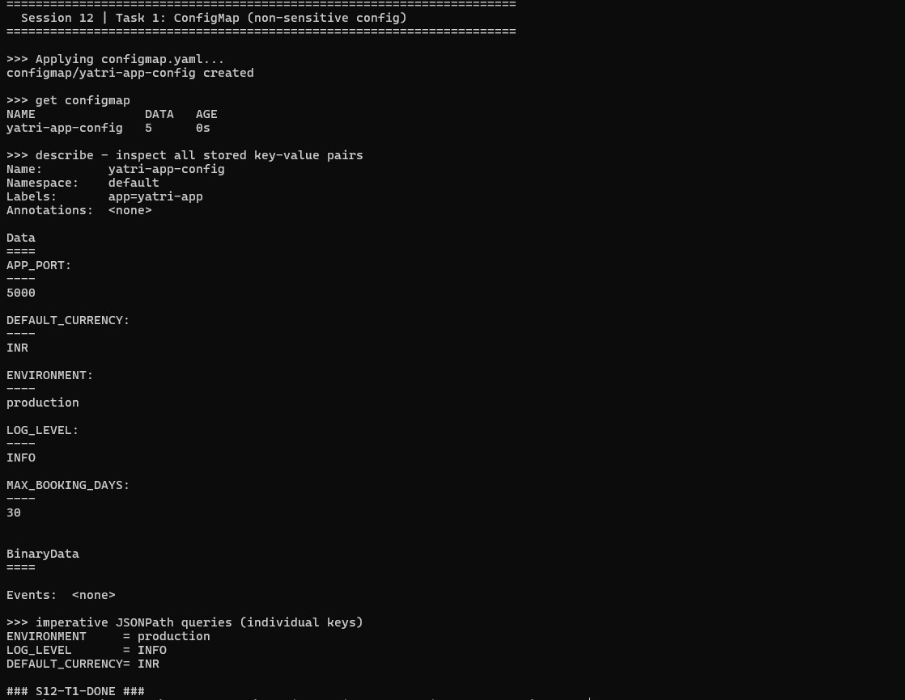
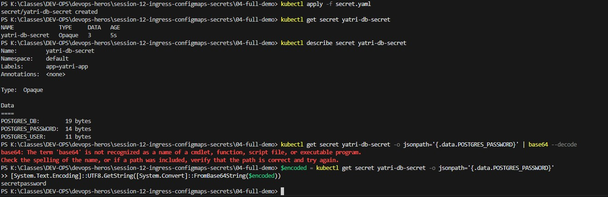
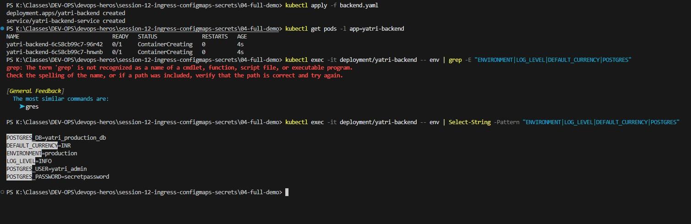
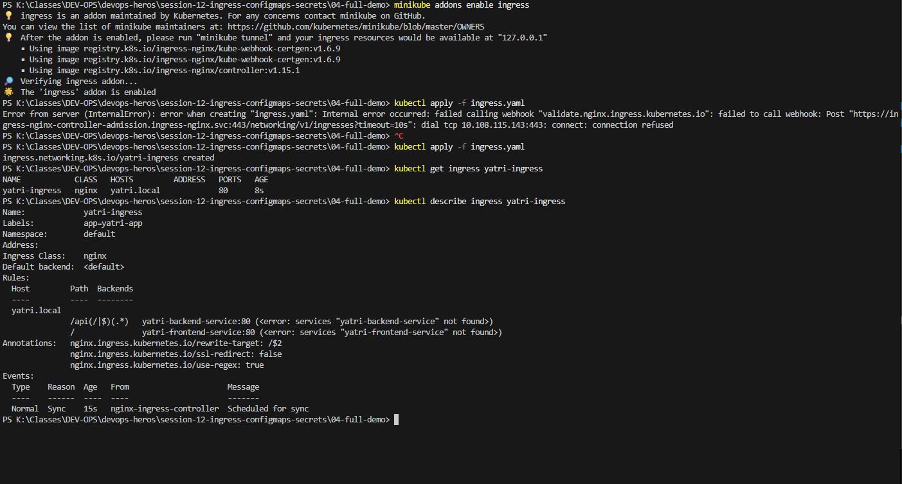
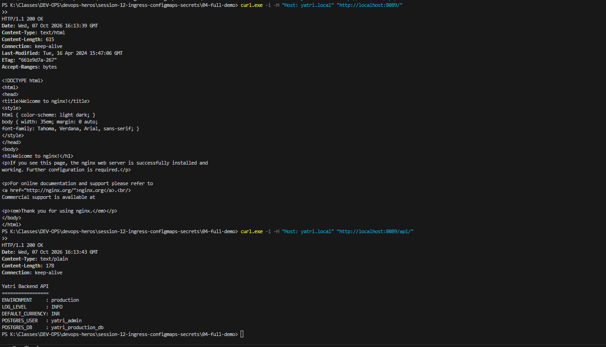
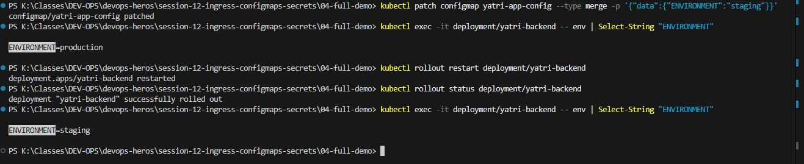

# Session 12 — Kubernetes Ingress, ConfigMaps & Secrets

Comprehensive hands-on lab submission for Kubernetes configuration management (ConfigMaps & Secrets), environment variable injections, NGINX Ingress controller routing, and live rolling restarts.

---

## Table of Contents

1. [Part 1 — ConfigMap: Plain-Text Configuration](#part-1--configmap-plain-text-configuration)
2. [Part 2 — Secret: Sensitive Database Credentials & Base64 Encoding](#part-2--secret-sensitive-database-credentials--base64-encoding)
3. [Part 3 — Backend Deployment: Injecting ConfigMap & Secret as Env Vars](#part-3--backend-deployment-injecting-configmap--secret-as-env-vars)
4. [Part 4 — Frontend Deployment & ClusterIP Services](#part-4--frontend-deployment--clusterip-services)
5. [Part 5 — Ingress Controller Setup & Routing Rules](#part-5--ingress-controller-setup--routing-rules)
6. [Part 6 — End-to-End Ingress Curl Verification](#part-6--end-to-end-ingress-curl-verification)
7. [Part 7 — Live ConfigMap Patch & Rolling Restart Drill](#part-7--live-configmap-patch--rolling-restart-drill)

---

## Part 1 — ConfigMap: Plain-Text Configuration

### Why
ConfigMaps store non-sensitive key-value pairs (app settings, feature flags, ports, log levels) decoupled from application code and container image definitions.

### Commands Executed

```bash
cd session-12-ingress-configmaps-secrets/04-full-demo

# 1. Apply ConfigMap
kubectl apply -f configmap.yaml

# 2. Verify ConfigMap
kubectl get configmap yatri-app-config
kubectl describe configmap yatri-app-config

# 3. Read specific key via jsonpath
kubectl get configmap yatri-app-config -o jsonpath='{.data.ENVIRONMENT}'
```

### Expected Output
- ConfigMap `yatri-app-config` created containing 5 key-value pairs (`ENVIRONMENT`, `LOG_LEVEL`, `APP_PORT`, `DEFAULT_CURRENCY`, `MAX_BOOKING_DAYS`).
- `jsonpath` query returns `production`.

### Terminal Proof / Screenshot



---

## Part 2 — Secret: Sensitive Database Credentials & Base64 Encoding

### Why
Secrets store sensitive data such as passwords, API keys, and certificates. 

> [!IMPORTANT]
> Always use `echo -n` when base64 encoding secrets to avoid appending a hidden trailing newline (`\n`) that invalidates database authentication.

### Base64 Encoding Rule

```bash
# Correct way (suppresses trailing newline)
echo -n "secretpassword" | base64
# Result: c2VjcmV0cGFzc3dvcmQ=

# Wrong way (appends trailing newline \n)
echo "secretpassword" | base64
# Result: c2VjcmV0cGFzc3dvcmQK
```

### Commands Executed

```bash
# 1. Apply Secret
kubectl apply -f secret.yaml

# 2. Verify Secret
kubectl get secret yatri-db-secret
kubectl describe secret yatri-db-secret

# 3. Decode Secret value
kubectl get secret yatri-db-secret -o jsonpath='{.data.POSTGRES_PASSWORD}' | base64 --decode
```

### Expected Output
- Secret `yatri-db-secret` of type `Opaque` created with 3 keys.
- `describe` masks actual values (displays byte sizes).
- Base64 decoding reveals `secretpassword`.

### Terminal Proof / Screenshot



---

## Part 3 — Backend Deployment: Injecting ConfigMap & Secret as Env Vars

### Why
Demonstrates how Kubernetes injects configuration values and secrets into application container environments using `envFrom` and `secretKeyRef`.

### Commands Executed

```bash
# 1. Apply Backend Deployment & Service
kubectl apply -f backend.yaml

# 2. Check Pod Status
kubectl get pods -l app=yatri-backend

# 3. Inspect Injected Environment Variables inside Pod
kubectl exec -it deployment/yatri-backend -- env | grep -E "ENVIRONMENT|LOG_LEVEL|DEFAULT_CURRENCY|POSTGRES"
```

### Expected Output

```text
ENVIRONMENT=production
LOG_LEVEL=INFO
DEFAULT_CURRENCY=INR
POSTGRES_USER=yatri_admin
POSTGRES_PASSWORD=secretpassword
POSTGRES_DB=yatri_production_db
```

### Terminal Proof / Screenshot



---

## Part 4 — Frontend Deployment & ClusterIP Services

### Why
Deploys frontend web interface. Both frontend and backend services run as internal `ClusterIP` services, requiring an Ingress layer to expose them externally.

### Commands Executed

```bash
# 1. Apply Frontend Deployment & Service
kubectl apply -f frontend.yaml

# 2. Check Pods and Services
kubectl get pods -l app=yatri-frontend
kubectl get svc yatri-frontend-service yatri-backend-service
```

### Expected Output
- Both `yatri-frontend` and `yatri-backend` pods running.
- Services show `TYPE: ClusterIP` with private cluster IPs.

### Terminal Proof / Screenshot


---

## Part 5 — Ingress Controller Setup & Routing Rules

### Why
Ingress acts as an HTTP/HTTPS router providing a single entry point for multi-service applications using path-based and host-based routing rules.

### Commands Executed

```bash
# 1. Enable NGINX Ingress Controller
minikube addons enable ingress

# 2. Apply Ingress Routing Rules
kubectl apply -f ingress.yaml

# 3. Verify Ingress Address Assignment
kubectl get ingress yatri-ingress
kubectl describe ingress yatri-ingress
```

### Routing Rules Mapping

```text
Host: yatri.local
├── /api/*   ---> yatri-backend-service:80
└── /        ---> yatri-frontend-service:80
```

### Terminal Proof / Screenshot



---

## Part 6 — End-to-End Ingress Curl Verification

### Why
Verifies that path-based routing correctly directs HTTP traffic through the Ingress controller.

### Commands Executed (Port-Forward via Port 8089)

```bash
# Terminal 1: Forward port 8089 to ingress controller
kubectl port-forward svc/ingress-nginx-controller -n ingress-nginx 8089:80

# Terminal 2: Verify path-based routing via Host header
curl.exe -i -H "Host: yatri.local" "http://localhost:8089/"
curl.exe -i -H "Host: yatri.local" "http://localhost:8089/api/"
```

### Expected Output
- Root `/` returns `<title>Welcome to nginx!</title>`
- API `/api/` returns backend environment configuration details (`ENVIRONMENT`, `POSTGRES_USER`, etc.).

### Terminal Proof / Screenshot



---

## Part 7 — Live ConfigMap Patch & Rolling Restart Drill

### Why
Demonstrates that updating a ConfigMap does not automatically update environment variables in running pods until a rolling restart (`rollout restart`) is performed.

### Commands Executed

```bash
# 1. Patch ConfigMap
kubectl patch configmap yatri-app-config --type merge -p '{"data":{"ENVIRONMENT":"staging"}}'

# 2. Check running pod env (still shows production)
kubectl exec -it deployment/yatri-backend -- env | grep ENVIRONMENT

# 3. Trigger Rolling Restart
kubectl rollout restart deployment/yatri-backend
kubectl rollout status deployment/yatri-backend

# 4. Verify updated env inside new pod (now shows staging)
kubectl exec -it deployment/yatri-backend -- env | grep ENVIRONMENT
```

### Terminal Proof / Screenshot



---

## Lab Cleanup

```bash
bash cleanup.sh
```
