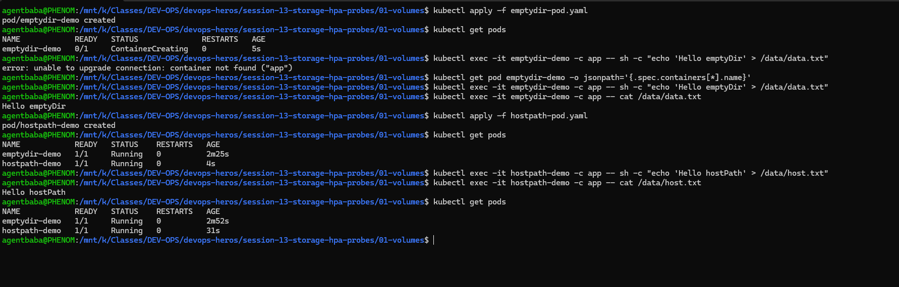
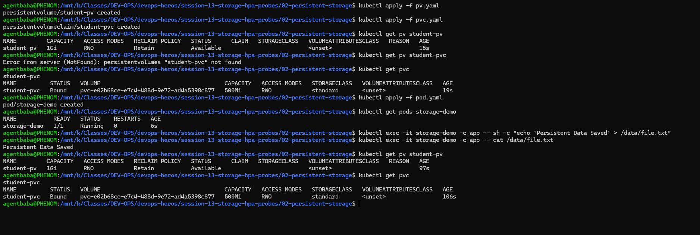
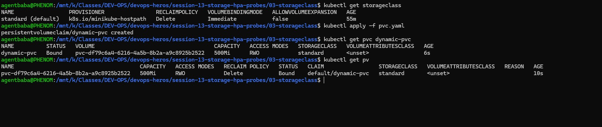
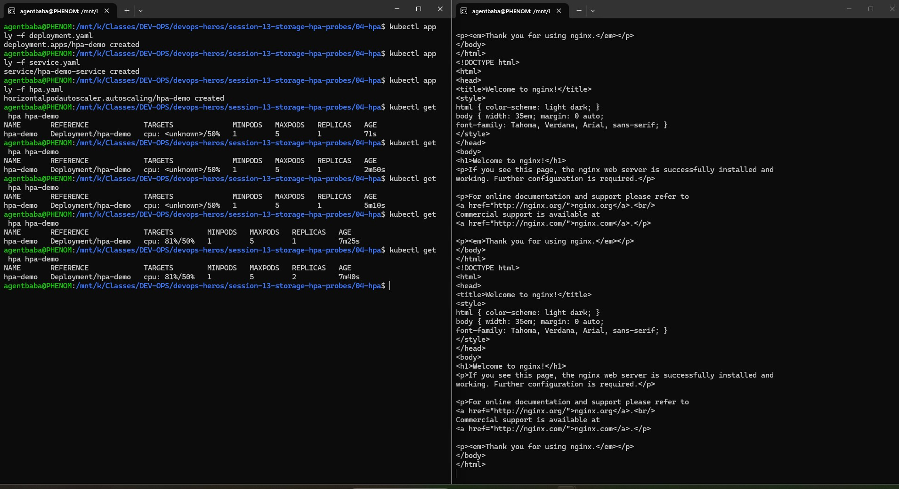
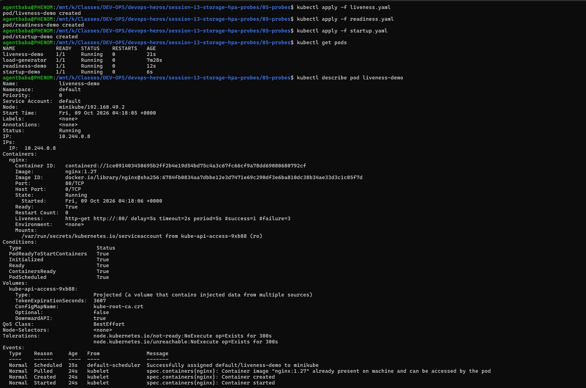
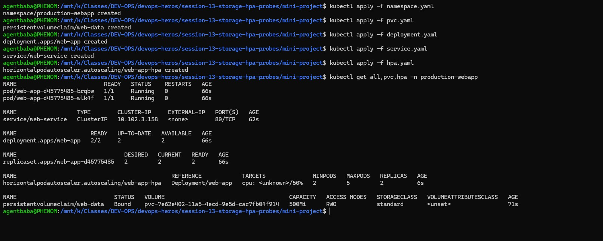

# Session 13 — Kubernetes Storage, HPA & Health Probes

Comprehensive hands-on lab submission for Kubernetes volume management (emptyDir & hostPath), persistent storage (PV & PVC), dynamic storage provisioning (StorageClass), Horizontal Pod Autoscaling (HPA), and Health Probes (Liveness, Readiness, Startup).

---

## Table of Contents

1. [Part 1 — Volumes: emptyDir & hostPath](#part-1--volumes-emptydir--hostpath)
2. [Part 2 — Persistent Storage: Static PV & PVC Binding](#part-2--persistent-storage-static-pv--pvc-binding)
3. [Part 3 — Dynamic Provisioning: StorageClass](#part-3--dynamic-provisioning-storageclass)
4. [Part 4 — Horizontal Pod Autoscaler (HPA)](#part-4--horizontal-pod-autoscaler-hpa)
5. [Part 5 — Health Probes: Liveness, Readiness & Startup](#part-5--health-probes-liveness-readiness--startup)
6. [Part 6 — Mini-Project: Integrated Production Workload](#part-6--mini-project-integrated-production-workload)

---

## Part 1 — Volumes: emptyDir & hostPath

### Why
- **emptyDir**: Ephemeral storage created when a Pod is assigned to a Node. Useful for temporary scratch data or caching.
- **hostPath**: Mounts a specific file or directory from the host node's filesystem (`/tmp/hostpath-data`) into the Pod container.

### Commands Executed

```bash
cd session-13-storage-hpa-probes/01-volumes

# 1. Apply emptyDir Pod
kubectl apply -f emptydir-pod.yaml
kubectl get pods

# 2. Verify writing and reading data in emptyDir volume (/data)
kubectl exec -it emptydir-demo -c app -- sh -c "echo 'Hello emptyDir' > /data/data.txt"
kubectl exec -it emptydir-demo -c app -- cat /data/data.txt

# 3. Apply hostPath Pod
kubectl apply -f hostpath-pod.yaml
kubectl get pods

# 4. Verify hostPath storage
kubectl exec -it hostpath-demo -c app -- sh -c "echo 'Hello hostPath' > /data/host.txt"
kubectl exec -it hostpath-demo -c app -- cat /data/host.txt
```

### Expected Output
- `emptydir-demo` and `hostpath-demo` Pods running with `1/1 READY`.
- Data written to `/data/data.txt` and `/data/host.txt` is verified via `cat`.

### Terminal Proof / Screenshot



---

## Part 2 — Persistent Storage: Static PV & PVC Binding

### Why
Decouples storage administration from Pod creation. A **PersistentVolume (PV)** (`student-pv`) is storage provisioned by an admin. A **PersistentVolumeClaim (PVC)** (`student-pvc`) is a request for storage by a workload.

### Commands Executed

```bash
cd session-13-storage-hpa-probes/02-persistent-storage

# 1. Apply Static PV and PVC
kubectl apply -f pv.yaml
kubectl apply -f pvc.yaml

# 2. Check Binding Status
kubectl get pv student-pv
kubectl get pvc student-pvc

# 3. Apply Pod mounting the PVC
kubectl apply -f pod.yaml
kubectl get pods storage-demo

# 4. Write data to persistent mount (/data)
kubectl exec -it storage-demo -c app -- sh -c "echo 'Persistent Data Saved' > /data/file.txt"
kubectl exec -it storage-demo -c app -- cat /data/file.txt
```

### Expected Output
- PV `student-pv` status: `Bound` to PVC `student-pvc`.
- PVC `student-pvc` status: `Bound` with `ReadWriteOnce` (RWO) access mode.
- Pod `storage-demo` mounts persistent storage at `/data`.

### Terminal Proof / Screenshot



---

## Part 3 — Dynamic Provisioning: StorageClass

### Why
Instead of manually defining PVs, a **StorageClass** dynamically provisions storage on-demand whenever a PVC is created.

### Commands Executed

```bash
cd session-13-storage-hpa-probes/03-storageclass

# 1. Check Available StorageClasses
kubectl get storageclass

# 2. Apply Dynamic PVC using standard StorageClass
kubectl apply -f pvc.yaml

# 3. Verify Dynamic PV Creation and Binding
kubectl get pvc dynamic-pvc
kubectl get pv
```

### Expected Output
- StorageClass `standard` (or `k8s.io/minikube-hostpath`) automatically provisions a new PV.
- PVC `dynamic-pvc` state transitions to `Bound`.

### Terminal Proof / Screenshot



---

## Part 4 — Horizontal Pod Autoscaler (HPA)

### Why
Automatically scales the number of Pod replicas in Deployment `hpa-demo` based on CPU utilization to handle load spikes.

### Prerequisites (Metrics Server Setup)

Before HPA can read CPU metrics, the **`metrics-server`** addon must be enabled and configured for Minikube's self-signed certificates:

```bash
# 1. Enable Metrics Server in minikube
minikube addons enable metrics-server

# 2. Patch metrics-server to bypass TLS verification (required for Minikube)
kubectl patch deployment metrics-server -n kube-system --type='json' -p='[{"op": "add", "path": "/spec/template/spec/containers/0/args/-", "value": "--kubelet-insecure-tls"}]'

# 3. Verify metrics-server pod is 1/1 Running
kubectl get pods -n kube-system -l k8s-app=metrics-server

# 4. Confirm Metrics API is active
kubectl top pods
```

### Commands Executed

```bash
cd session-13-storage-hpa-probes/04-hpa

# 1. Apply Deployment, Service, and HPA
kubectl apply -f deployment.yaml
kubectl apply -f service.yaml
kubectl apply -f hpa.yaml

# 2. Check HPA Status
kubectl get hpa hpa-demo

# 3. Generate CPU Load (in a separate terminal)
kubectl run -i --tty load-generator --rm --image=busybox:1.36 --restart=Never -- /bin/sh -c "while true; do wget -q -O- http://hpa-demo-service; done"

# 4. Watch HPA Autoscale Pod Replicas
kubectl get hpa hpa-demo -w
```

### Expected Output
- HPA detects CPU utilization exceeding 50% target.
- Deployment `hpa-demo` autoscales from 1 up to max 5 replicas.

### Terminal Proof / Screenshot



---

## Part 5 — Health Probes: Liveness, Readiness & Startup

### Why
- **Liveness Probe**: Restarts the container if the check fails.
- **Readiness Probe**: Controls whether the Pod receives traffic from a Service.
- **Startup Probe**: Protects slow-starting applications before liveness/readiness probes engage.

### Commands Executed

```bash
cd session-13-storage-hpa-probes/05-probes

# 1. Apply Liveness Probe Pod
kubectl apply -f liveness.yaml
kubectl get pod liveness-demo
kubectl describe pod liveness-demo

# 2. Apply Readiness Probe Pod
kubectl apply -f readiness.yaml
kubectl get pod readiness-demo
kubectl describe pod readiness-demo

# 3. Apply Startup Probe Pod
kubectl apply -f startup.yaml
kubectl get pod startup-demo
```

### Expected Output
- `liveness-demo`, `readiness-demo`, and `startup-demo` Pods created and monitored via HTTP probes on port 80.

### Terminal Proof / Screenshot



---

## Part 6 — Mini-Project: Integrated Production Workload

### Why
Combines all concepts into a production-ready stack in namespace `production-webapp`: custom Namespace, PVC storage (`web-data`), resource limits, health probes, Recreate strategy, Service, and HPA autoscaler (`web-app-hpa`).

### Commands Executed

```bash
cd session-13-storage-hpa-probes/mini-project

# 1. Apply Full Production Stack
kubectl apply -f namespace.yaml
kubectl apply -f pvc.yaml
kubectl apply -f deployment.yaml
kubectl apply -f service.yaml
kubectl apply -f hpa.yaml

# 2. Verify Resources in production-webapp Namespace
kubectl get all,pvc,hpa -n production-webapp
```

### Terminal Proof / Screenshot



---

## Lab Cleanup

```bash
kubectl delete -f mini-project/
kubectl delete -f 05-probes/
kubectl delete -f 04-hpa/
kubectl delete -f 03-storageclass/
kubectl delete -f 02-persistent-storage/
kubectl delete -f 01-volumes/
```
