# Session 10 — Kubernetes Core Objects Submissions

Comprehensive overview of all Kubernetes core objects, pod lifecycles, workload controllers, deployment strategies, and troubleshooting drills.

---

## Table of Contents

1. [Task 1 — Kubernetes Cluster Health Check](#task-1--kubernetes-cluster-health-check)
2. [Task 2 — Nginx Pod: Create / Inspect / Logs / Exec / Delete](#task-2--nginx-pod-create--inspect--logs--exec--delete)
3. [Task 3 — ImagePullBackOff Error Diagnostic](#task-3--imagepullbackoff-error-diagnostic)
4. [Task 4 — Pod Lifecycle Stages (ContainerCreating → Running → Completed)](#task-4--pod-lifecycle-stages-containercreating--running--completed)
5. [Task 5 — Pod Lifecycle Deep Dive (States, Probes, Init Containers, Sidecars & Graceful Termination)](#task-5--pod-lifecycle-deep-dive-states-probes-init-containers-sidecars--graceful-termination)
6. [Task 6 — ReplicaSet Self-Healing & StatefulSet Ordinals with PVCs](#task-6--replicaset-self-healing--statefulset-ordinals-with-pvcs)
7. [Task 7 — DaemonSet (One Pod Per Node)](#task-7--daemonset-one-pod-per-node)
8. [Task 8 — Rolling Update Strategy & Rollback](#task-8--rolling-update-strategy--rollback)
9. [Task 9 — Troubleshooting Drills (Broken Image & Selector Mismatch)](#task-9--troubleshooting-drills-broken-image--selector-mismatch)
10. [Task 10 — Blue-Green Deployment & Cutover](#task-10--blue-green-deployment--cutover)
11. [Task 11 — Canary Deployment & Traffic Split](#task-11--canary-deployment--traffic-split)
12. [Task 12 — Recreate Strategy (Outage Window & Rollback)](#task-12--recreate-strategy-outage-window--rollback)

---

## Task 1 — Kubernetes Cluster Health Check

### Why
Before running any workloads, we verify the Kubernetes cluster is healthy by checking:
- Client and server versions
- Control plane status
- Node readiness
- All system pods running

### Commands Used

```powershell
kubectl version
kubectl cluster-info
kubectl get nodes -o wide
kubectl get pods -A
```

### Key Takeaway
A healthy cluster shows all system components `Running` and the node in `Ready` state before any application workloads are deployed.

### Terminal Proof / Screenshot

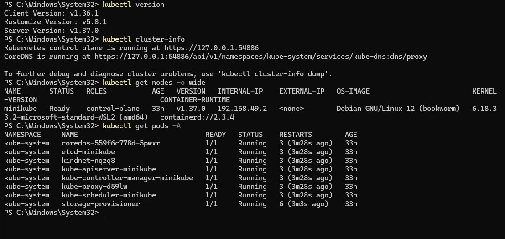

---

## Task 2 — Nginx Pod: Create / Inspect / Logs / Exec / Delete

### Why
Demonstrates the full CRUD lifecycle of a single pod — creating it, inspecting it in multiple ways, viewing stdout logs, running internal commands, and cleaning up.

### Commands Used

```powershell
kubectl apply -f pod.yml
kubectl get pods -o wide
kubectl describe pod nginx-pod
kubectl logs nginx-pod
kubectl exec -it nginx-pod -- ls /usr/share/nginx/html
kubectl delete pod nginx-pod
```

### Key Takeaway
A pod is the smallest deployable unit in Kubernetes. Use `describe` for event traces, `logs` for stdout/stderr debugging, and `exec` to execute shell commands inside running containers.

### Terminal Proof / Screenshots

#### 1. Apply & Describe
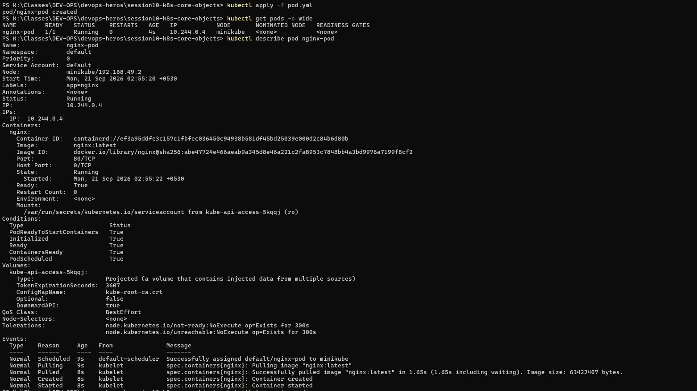

#### 2. Logs, Exec & Delete
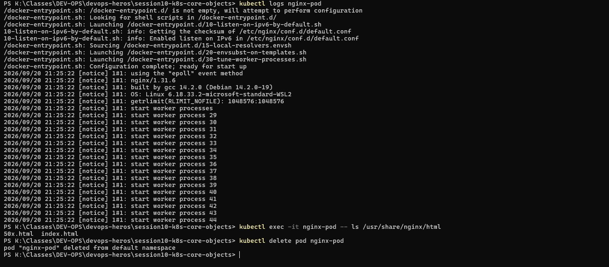

---

## Task 3 — ImagePullBackOff Error Diagnostic

### Why
Demonstrates the most common real-world Kubernetes failure — using a non-existent image tag causes kubelet to cycle through `ErrImagePull` → `ImagePullBackOff`.

### Commands Used

```powershell
kubectl apply -f .\Submissions\SS\imagepullbackoff\lifecycle-image-error.yml
kubectl get pod lifecycle-image-error -w
kubectl describe pod lifecycle-image-error
kubectl delete pod lifecycle-image-error
```

### Key Takeaway
When a pod shows `ImagePullBackOff`, run `kubectl describe pod <name>` to check the Events section. It highlights the exact root cause (invalid image repository, wrong tag, or missing pull secrets).

### Terminal Proof / Screenshot

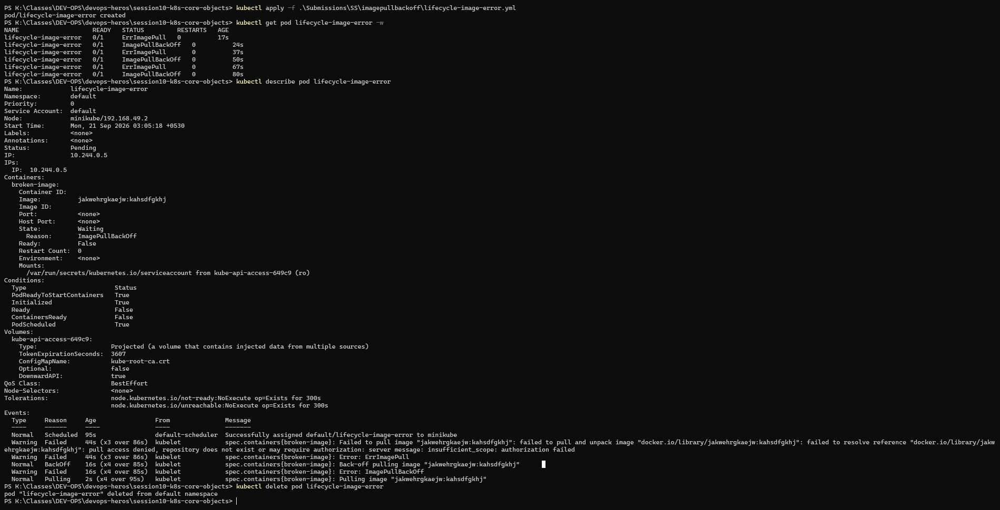

---

## Task 4 — Pod Lifecycle Stages (ContainerCreating → Running → Completed)

### Why
Shows the complete lifecycle of a short-lived pod — from creation through execution to completion.

### Commands Used

```powershell
kubectl apply -f .\pod-lifecycle\lifecycle.yml
kubectl get pod hello-pod -w
kubectl logs hello-pod
kubectl delete pod hello-pod
```

### Key Takeaway
With `restartPolicy: Never`, a pod that exits successfully (exit code 0) stays in `Completed` state and is never restarted. Ideal for batch jobs and one-time tasks.

### Terminal Proof / Screenshot

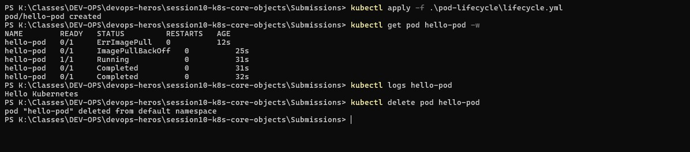

---

## Task 5 — Pod Lifecycle Deep Dive (States, Probes, Init Containers, Sidecars & Graceful Termination)

### Why
Explores all major pod lifecycle states, readiness/liveness/startup probes, init containers, sidecars, and graceful termination timeouts.

### 5A — Basic States: Running / Succeeded / Failed

```powershell
kubectl apply -f pod-lifecycle/01-running.yaml
kubectl apply -f pod-lifecycle/03-succeeded.yaml
kubectl apply -f pod-lifecycle/04-failed.yaml
kubectl get pods -o wide
kubectl logs lifecycle-succeeded
kubectl logs lifecycle-failed
kubectl delete pod lifecycle-running lifecycle-succeeded lifecycle-failed
```

### 5B — Pending, CrashLoopBackOff, Readiness & Liveness Probes

```powershell
kubectl apply -f pod-lifecycle/02-pending.yaml
kubectl describe pod lifecycle-pending | Select-String -Pattern "Events:" -Context 0,4
kubectl apply -f pod-lifecycle/05-crashloopbackoff.yaml
kubectl apply -f pod-lifecycle/07-readiness.yaml
kubectl apply -f pod-lifecycle/08-liveness.yaml
kubectl apply -f pod-lifecycle/09-startup.yaml
kubectl get pods -o wide
kubectl delete pods --all
```

### 5C — Init Container, Multi-Container Sidecar & Graceful Termination

```powershell
kubectl apply -f pod-lifecycle/10-init-container.yaml
kubectl apply -f pod-lifecycle/11-multi-container.yaml
kubectl get pod lifecycle-multi-container
kubectl logs lifecycle-multi-container -c sidecar
kubectl apply -f pod-lifecycle/12-termination.yaml
Measure-Command { kubectl delete -f pod-lifecycle/12-termination.yaml }
```

### Terminal Proof / Screenshots

#### 1. Running / Succeeded / Failed States
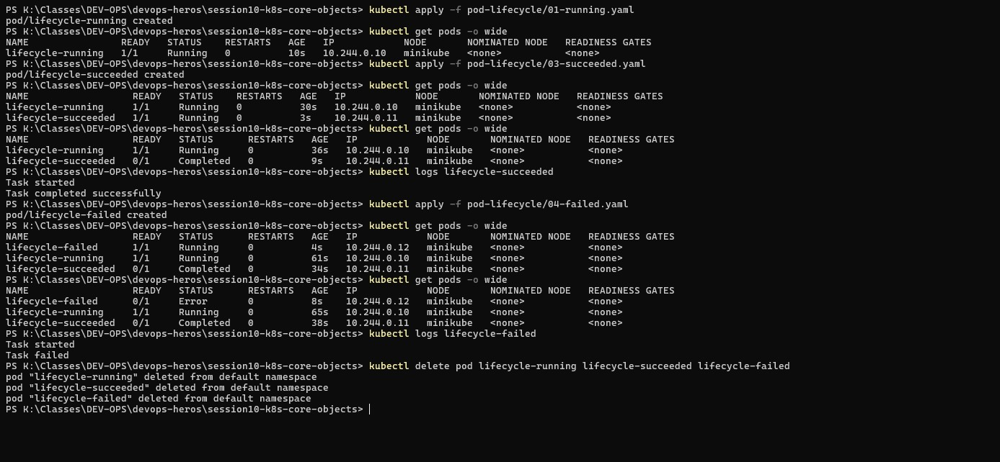

#### 2. Probes / CrashLoop / Pending
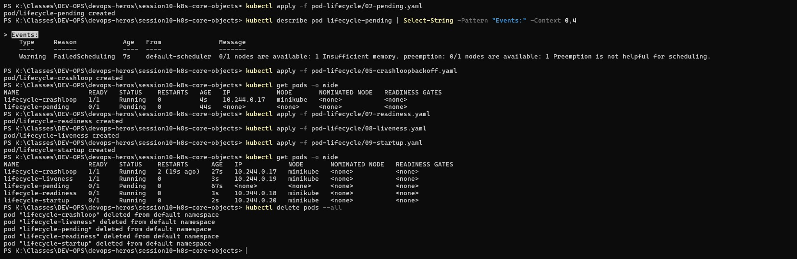

#### 3. Init Container / Sidecar / Graceful Termination
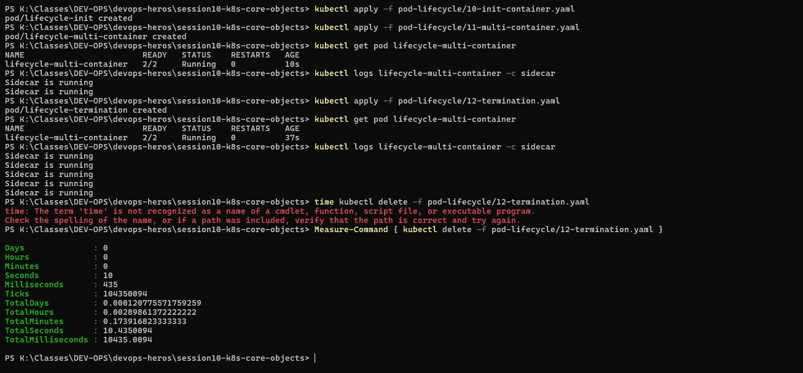

---

## Task 6 — ReplicaSet Self-Healing & StatefulSet Ordinals with PVCs

### Why
Demonstrates two key Kubernetes controllers:
- **ReplicaSet** — maintains a desired pod count with self-healing
- **StatefulSet** — creates pods with stable identities (`mysql-0`, `mysql-1`) and persistent storage claims

### Commands Used

```powershell
kubectl apply -f k8s-core-objects/replicaset.yml
kubectl get rs myapp-rs
kubectl get all
kubectl delete pod myapp-rs-9rdsc
kubectl get pods -l app=nginx -o wide
kubectl apply -f k8s-core-objects/statefulset.yml
kubectl get statefulset mysql
kubectl get pvc -l app=mysql
kubectl delete rs nginx-rs --force
kubectl delete statefulset mysql --force
kubectl delete pvc -l app=mysql
```

### Key Takeaway

| Feature | ReplicaSet | StatefulSet |
|---------|-----------|-------------|
| Pod names | Random (hash-based) | Deterministic (`name-0`, `name-1`) |
| Creation order | Parallel | Sequential |
| Storage | Shared / None | Individual PVC per pod |
| Use case | Stateless applications | Databases & stateful stores |

### Terminal Proof / Screenshot

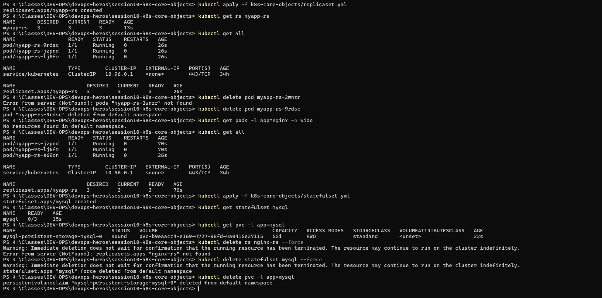

---

## Task 7 — DaemonSet (One Pod Per Node)

### Why
A DaemonSet ensures exactly one pod runs on every eligible node — commonly used for monitoring agents (`node-exporter`), log collectors (`fluentd`), and networking plugins.

### Commands Used

```powershell
kubectl apply -f k8s-core-objects/deamonset.yml
kubectl get ds node-exporter
kubectl get pods -l app=node-exporter -o wide
kubectl delete ds node-exporter
```

### Terminal Proof / Screenshot

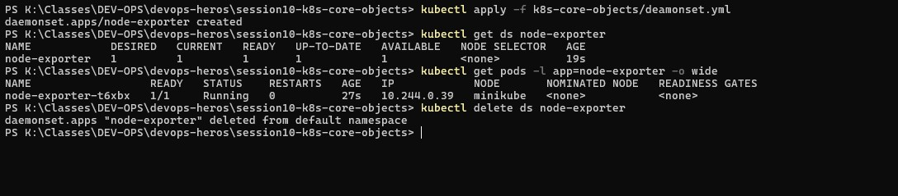

---

## Task 8 — Rolling Update Strategy & Rollback

### Why
Demonstrates zero-downtime deployments using the `RollingUpdate` strategy, and how to rollback to previous revisions.

### Commands Used

```powershell
# Deploy v1 & Update to v2
kubectl apply -f 01-rolling-update/deployment-v1.yaml
kubectl apply -f 01-rolling-update/service.yaml
kubectl apply -f 01-rolling-update/deployment-v2.yaml
kubectl rollout status deployment/app-rolling
kubectl rollout history deployment/app-rolling

# Rollback to v1 or targeted revision
kubectl rollout undo deployment/app-rolling
kubectl rollout undo deployment/app-rolling --to-revision=1
```

### Terminal Proof / Screenshots

#### 1. Rolling Update & Undo Rollback
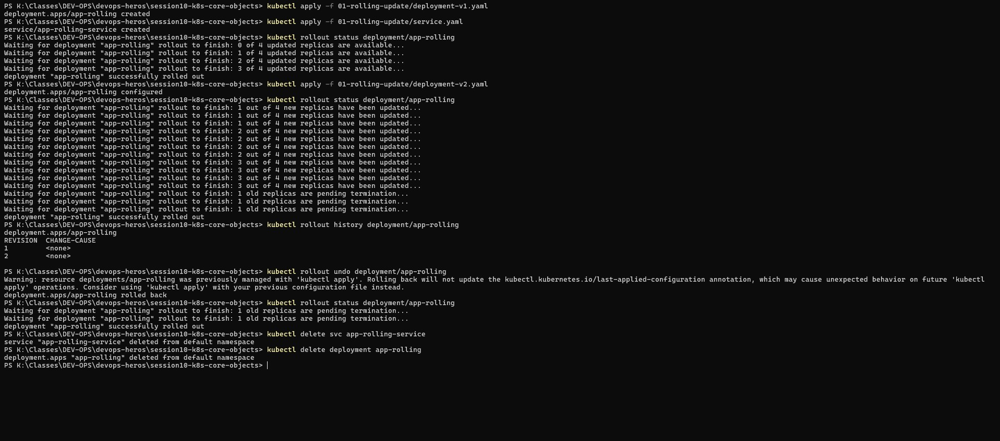

#### 2. Multi-Version Rollback
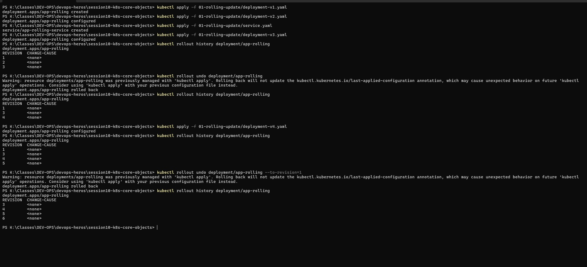

---

## Task 9 — Troubleshooting Drills (Broken Image & Selector Mismatch)

### Why
Practices two common real-world Kubernetes troubleshooting scenarios:
1. **Broken image rollout** — deployment stalls when a pod can't pull the image
2. **Immutable selector mismatch** — API server rejects a Deployment where selector doesn't match template labels

### Commands Used

```powershell
# Drill 1: Broken Image
kubectl apply -f troubleshooting/broken-image.yaml
kubectl rollout status deployment/yatri-backend --timeout=30s

# Drill 2: Selector Mismatch & Fix
kubectl apply -f troubleshooting/selector-mismatch.yaml    # REJECTED
kubectl apply -f .\Submissions\Troubleshootingdrills\fix.yml  # Fixed version
```

### Terminal Proof / Screenshot

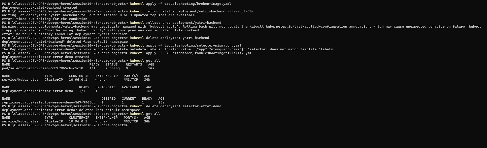

---

## Task 10 — Blue-Green Deployment & Cutover

### Why
Blue-Green deployment runs two full environments side-by-side. Traffic is switched instantly by changing the Service selector — no rollout delay, zero downtime.

### Commands Used

```powershell
# Deploy both environments
kubectl apply -f 02-blue-green\deployment-blue.yaml
kubectl apply -f 02-blue-green\deployment-green.yaml

# Route traffic to BLUE -> GREEN -> ROLLBACK to BLUE
kubectl apply -f 02-blue-green\service-blue.yaml
curl http://localhost:30020

kubectl apply -f 02-blue-green\service-green.yaml
curl http://localhost:30020

kubectl apply -f 02-blue-green\service-blue.yaml
curl http://localhost:30020
```

### Terminal Proof / Screenshot


---

## Task 11 — Canary Deployment & Traffic Split

### Why
A canary deployment routes a small percentage of traffic to the new version while most users still hit the stable version.

### Traffic Split Ratios

| Phase | Canary Replicas | Stable Replicas | Total | Expected Canary % |
|-------|----------------|-----------------|-------|-------------------|
| Initial | 1 | 9 | 10 | ~10% |
| Scale up | 3 | 7 | 10 | ~30% |
| Rollback | 0 | 9 | 9 | 0% |

### Commands Used

```powershell
kubectl apply -f 03-canary/deployment-stable.yaml
kubectl apply -f 03-canary/service.yaml
kubectl apply -f 03-canary/deployment-canary.yaml

# Scale canary up to 30% or back to 0%
kubectl scale deployment app-canary --replicas=3
kubectl scale deployment app-stable --replicas=7
kubectl scale deployment app-canary --replicas=0
```

---

## Task 12 — Recreate Strategy (Outage Window & Rollback)

### Why
The `Recreate` strategy terminates **all** old pods before starting new ones, causing a temporary outage window. Useful when two versions cannot run concurrently (e.g. database schema migrations).

### Commands Used

```powershell
kubectl apply -f 04-recreate/deployment-v1.yaml
kubectl apply -f 04-recreate/service.yaml
kubectl apply -f 04-recreate/deployment-v2.yaml
kubectl rollout status deployment/app-recreate
kubectl rollout undo deployment/app-recreate
```

### Terminal Proof / Screenshots

#### 1. Recreate Downtime Outage Window
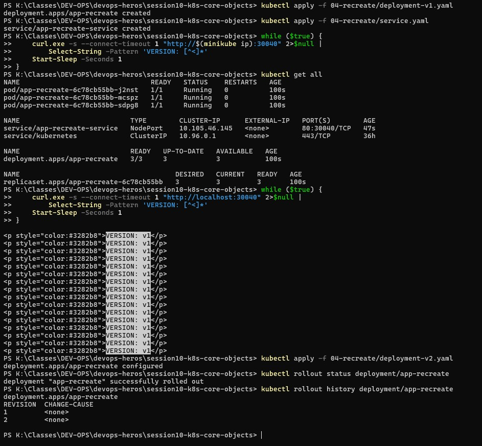

#### 2. Recreate Rollback History
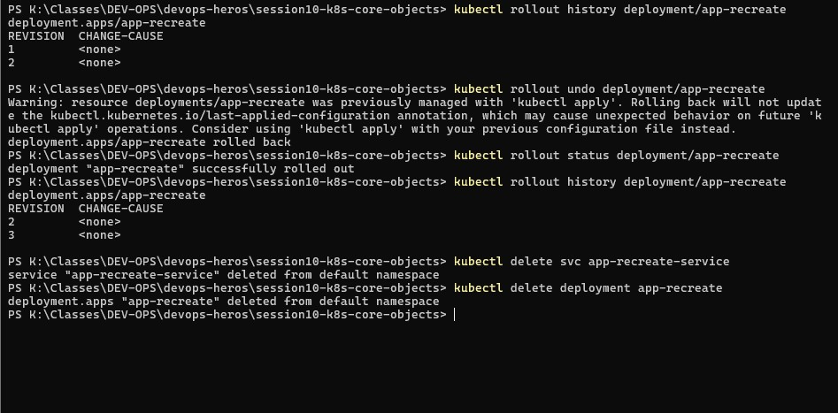
