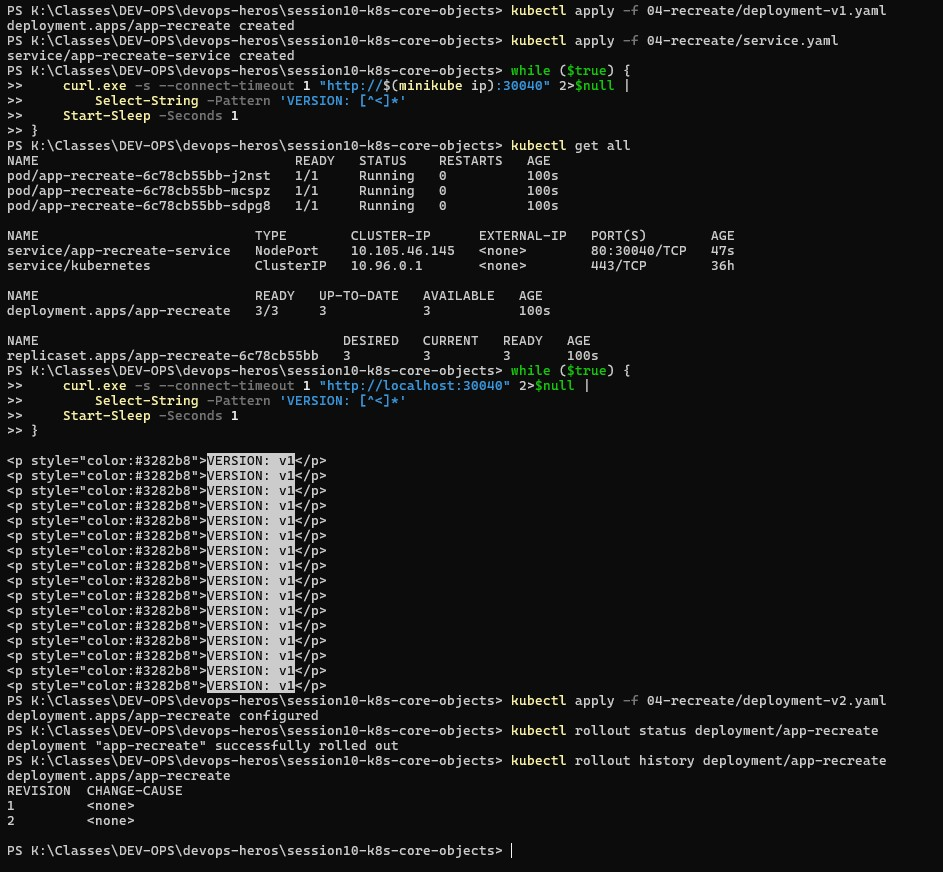
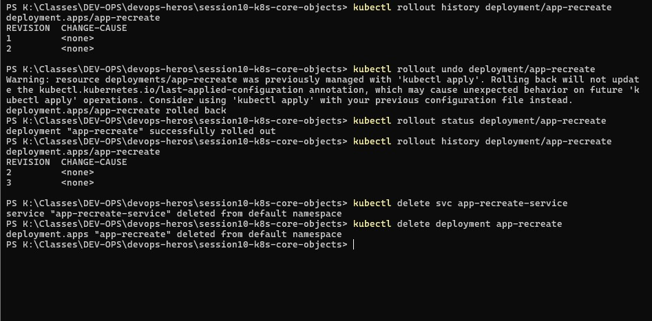

# Task 13 — Recreate Strategy: Outage Window & Rollback

## Why
The Recreate strategy terminates **all** old pods before starting new ones, causing a temporary outage. This demonstrates the downtime window and how to rollback using rollout history.

## Commands Used

### 13a — Recreate with Live Outage Monitoring

```powershell
# Deploy v1 with Recreate strategy
kubectl apply -f 04-recreate/deployment-v1.yaml
kubectl apply -f 04-recreate/service.yaml

# Start live monitoring loop (PowerShell)
while ($true) {
    curl.exe -s --connect-timeout 1 "http://localhost:30040" 2>$null |
        Select-String -Pattern 'VERSION: [^<]*'
    Start-Sleep -Seconds 1
}

# In another terminal, apply v2 to trigger Recreate
kubectl apply -f 04-recreate/deployment-v2.yaml
kubectl rollout status deployment/app-recreate
kubectl rollout history deployment/app-recreate
```

### 13b — Rollback via History

```powershell
kubectl rollout history deployment/app-recreate
kubectl rollout undo deployment/app-recreate
kubectl rollout status deployment/app-recreate
kubectl rollout history deployment/app-recreate

# Cleanup
kubectl delete svc app-recreate-service
kubectl delete deployment app-recreate
```

## Screenshot 1 — Recreate Downtime Outage

The live curl loop captures the full sequence:

| Output | What's Happening |
|--------|-----------------|
| `VERSION: v1` (×20+) | v1 pods serving traffic normally |
| `[OUTAGE] Connection refused / 0 pods alive` | All v1 pods killed, v2 not yet started — **OUTAGE** |
| `VERSION: v2 (UPGRADED)` (×8+) | v2 pods now running and serving traffic |

- **Rollout history** shows REVISION 1 (v1) and REVISION 2 (v2)
- `rollout status` confirms: "deployment 'app-recreate' successfully rolled out"

## Screenshot 2 — Rollback History & Undo

- **Rollout history** — REVISION 1 and REVISION 2
- **`rollout undo`** — triggers another Recreate cycle back to v1
- Rollout completes successfully
- **Final history** — REVISION 2 and REVISION 3 (rollback creates a new revision)
- Cleanup: service and deployment deleted

## Key Takeaway

| Strategy | Downtime | When to Use |
|----------|----------|-------------|
| **RollingUpdate** | Zero | Web services, APIs (default) |
| **Recreate** | Full outage window | Batch jobs, dev/test, when two versions can't coexist |

The Recreate strategy is simpler but requires a maintenance window since clients will experience connection refused errors during the swap.



