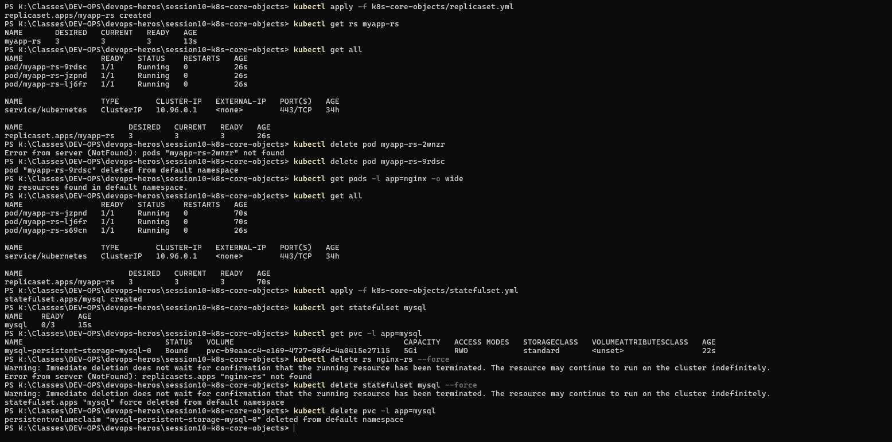

# Task 6 — ReplicaSet Self-Healing + StatefulSet Ordinals & PVCs

## Why
Demonstrates two key Kubernetes controllers:
- **ReplicaSet** — maintains a desired pod count with self-healing
- **StatefulSet** — creates pods with stable identities and persistent storage

## Commands Used

```powershell
kubectl apply -f k8s-core-objects/replicaset.yml
kubectl get rs myapp-rs
kubectl get all
kubectl delete pod myapp-rs-9rdsc
kubectl get pods -l app=nginx -o wide
kubectl get all
kubectl apply -f k8s-core-objects/statefulset.yml
kubectl get statefulset mysql
kubectl get pvc -l app=mysql
kubectl delete rs nginx-rs --force
kubectl delete statefulset mysql --force
kubectl delete pvc -l app=mysql
```

## What the Screenshot Shows

### ReplicaSet (Self-Healing)
- `myapp-rs` created with **DESIRED=3, CURRENT=3, READY=3**
- Pod `myapp-rs-9rdsc` deleted → ReplicaSet **instantly created a replacement** (`myapp-rs-s69cn`) to keep desired count at 3
- All 3 pods remain Running — self-healing in action

### StatefulSet (Ordinals + PVCs)
- `mysql` StatefulSet created — pods created **sequentially**: mysql-0, mysql-1, mysql-2
- Each pod gets a **PersistentVolumeClaim**:
  - `mysql-persistent-storage-mysql-0` — Bound, 5Gi, RWO
  - `mysql-persistent-storage-mysql-1` — Bound, 5Gi, RWO
  - `mysql-persistent-storage-mysql-2` — Bound, 5Gi, RWO

## Key Takeaway

| Feature | ReplicaSet | StatefulSet |
|---------|-----------|-------------|
| Pod names | Random (hash-based) | Deterministic (name-0, name-1, name-2) |
| Creation order | Parallel | Sequential (one at a time) |
| Storage | Shared/none | Individual PVC per pod |
| Self-healing | Yes | Yes |
| Use case | Stateless apps | Databases, stateful workloads |


