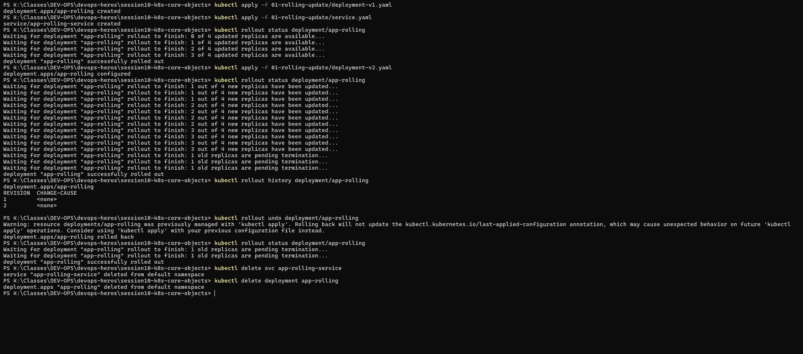
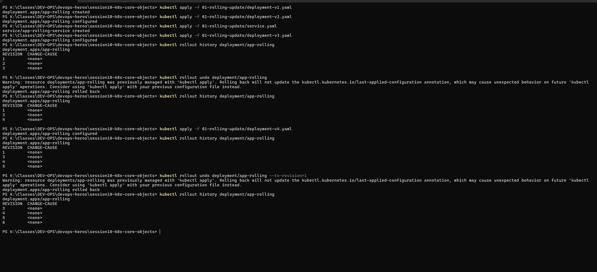

# Task 8 — Rolling Update & Rollback

## Why
Demonstrates zero-downtime deployments using the RollingUpdate strategy, and how to rollback to a previous version if something goes wrong.

## Commands Used

```powershell
# Deploy v1
kubectl apply -f 01-rolling-update/deployment-v1.yaml
kubectl apply -f 01-rolling-update/service.yaml
kubectl rollout status deployment/app-rolling

# Update to v2
kubectl apply -f 01-rolling-update/deployment-v2.yaml
kubectl rollout status deployment/app-rolling

# Check history
kubectl rollout history deployment/app-rolling

# Rollback to v1
kubectl rollout undo deployment/app-rolling
kubectl rollout status deployment/app-rolling

# Cleanup
kubectl delete svc app-rolling-service
kubectl delete deployment app-rolling
```

## Screenshot 1 — Rolling Update & Rollback

- **v1 deployed** — 4 replicas, `deployment "app-rolling" successfully rolled out`
- **v2 applied** — gradual rollout:
  - "1 out of 4 new replicas have been updated..." → "2 out of 4..." → "3 out of 4..."
  - "1 old replicas are pending termination..."
- **Rollout history** — REVISION 1 (v1), REVISION 2 (v2)
- **Rollback** — `deployment.apps/app-rolling rolled back`
  - Pods transition: old v2 pods Terminating, v1 pods Running again
- **Cleanup** — service and deployment deleted

## Screenshot 2 — Multi-Version Rollback (Homework)

- Applied v1 → v2 → v3 → v4 (4 revisions)
- Used `kubectl rollout undo --to-revision=1` to jump directly to revision 1
- Rollout history shows revisions: 3, 4, 5, 6

## Key Takeaway

| Command | What it does |
|---------|-------------|
| `rollout status` | Watch rollout progress in real-time |
| `rollout history` | List all revisions |
| `rollout undo` | Rollback to previous revision |
| `rollout undo --to-revision=N` | Rollback to a specific revision |



