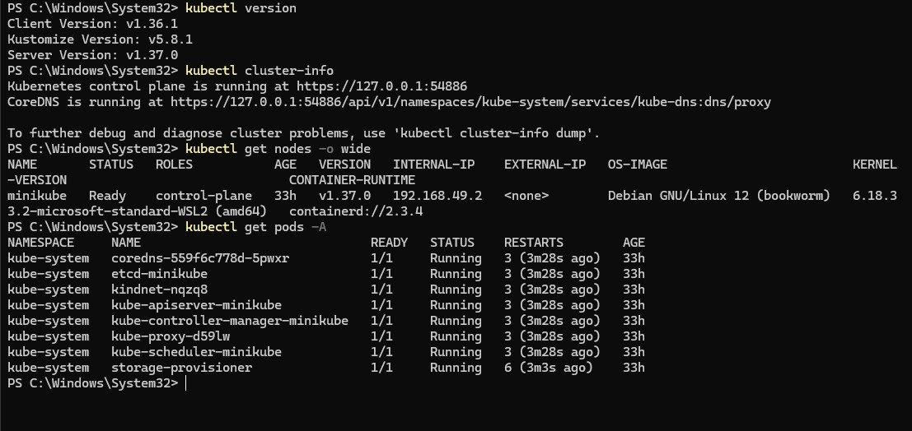

# Task 1 — Cluster Health Check

## Why
Before running any workloads, we verify the Kubernetes cluster is healthy by checking:
- Client and server versions
- Control plane status
- Node readiness
- All system pods running

## Commands Used

```powershell
kubectl version
kubectl cluster-info
kubectl get nodes -o wide
kubectl get pods -A
```

## What the Screenshot Shows

- **Client Version:** v1.36.1, **Server Version:** v1.37.0
- **Control plane** running at `https://127.0.0.1:54886`
- **CoreDNS** running at the kube-dns proxy endpoint
- **Node `minikube`** is `Ready` with role `control-plane`, running on Debian GNU/Linux 12 (bookworm) with containerd://2.3.4
- All **kube-system pods** (coredns, etcd, kube-apiserver, kube-controller-manager, kube-proxy, kube-scheduler, storage-provisioner) are `Running` with `1/1` READY

## Key Takeaway
A healthy cluster shows all system components Running and the node in Ready state before any application workloads are deployed.


