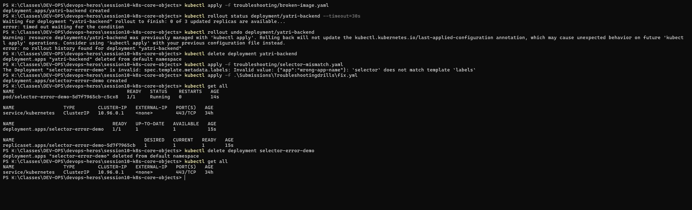

# Task 9 — Troubleshooting Drills

## Why
Practices two common real-world Kubernetes troubleshooting scenarios:
1. **Broken image rollout** — deployment stalls when a pod can't pull the image
2. **Immutable selector mismatch** — API server rejects a Deployment where selector doesn't match template labels

## Commands Used

### Drill 1 — Broken Image Rollout

```powershell
kubectl apply -f troubleshooting/broken-image.yaml
kubectl rollout status deployment/yatri-backend --timeout=30s
kubectl rollout undo deployment/yatri-backend
kubectl delete deployment yatri-backend
```

### Drill 2 — Selector Mismatch

```powershell
kubectl apply -f troubleshooting/selector-mismatch.yaml    # REJECTED
kubectl apply -f .\Submissions\Troubleshootingdrills\fix.yml  # Fixed version
kubectl get all
kubectl delete deployment selector-error-demo
```

## What the Screenshot Shows

### Drill 1 — Broken Image
- `yatri-backend` deployment created but rollout **times out** after 30s
- Error: "timed out waiting for the condition" — new pod can't pull image
- `rollout undo` fails: "no rollout history found" (first revision can't be undone)
- Deleted and moved on

### Drill 2 — Selector Mismatch
- Applying `selector-mismatch.yaml` produces error:
  > The Deployment "selector-error-demo" is invalid: spec.template.metadata.labels: Invalid value: {"app":"wrong-app-name"}: `selector` does not match template `labels`
- **Fix applied** using `fix.yml` where selector matches template labels (`app: my-app`)
- Pod created successfully: `selector-error-demo-5d7f7965cb-c5cx8` — 1/1 Running

## Key Takeaway

| Problem | Symptom | Fix |
|---------|---------|-----|
| Broken image | Pod stuck in `ImagePullBackOff` | Check image name/tag, use `describe` to see events |
| Selector mismatch | API rejects manifest before creation | Ensure `selector.matchLabels` matches `template.metadata.labels` exactly |


