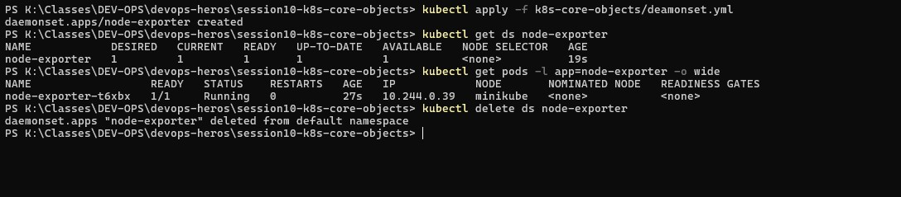

# Task 7 — DaemonSet: One Pod Per Node

## Why
A DaemonSet ensures exactly one pod runs on every eligible node — commonly used for monitoring agents, log collectors, and node-level services.

## Commands Used

```powershell
kubectl apply -f k8s-core-objects/deamonset.yml
kubectl get ds node-exporter
kubectl get pods -l app=node-exporter -o wide
kubectl delete ds node-exporter
```

## What the Screenshot Shows

1. **DaemonSet created** — `node-exporter`
2. **`kubectl get ds`** shows:
   - DESIRED: 1, CURRENT: 1, READY: 1, UP-TO-DATE: 1, AVAILABLE: 1
   - NODE SELECTOR: `<none>` (runs on all nodes)
3. **`kubectl get pods`** shows:
   - `node-exporter-t6xbx` — 1/1 Running, IP `10.244.0.39`, on node `minikube`
4. **Cleanup** — DaemonSet deleted successfully

## Key Takeaway
On a single-node cluster (minikube), a DaemonSet creates exactly 1 pod. On a multi-node cluster, it would create one pod per node automatically. If you add a new node, the DaemonSet automatically schedules a pod on it.


