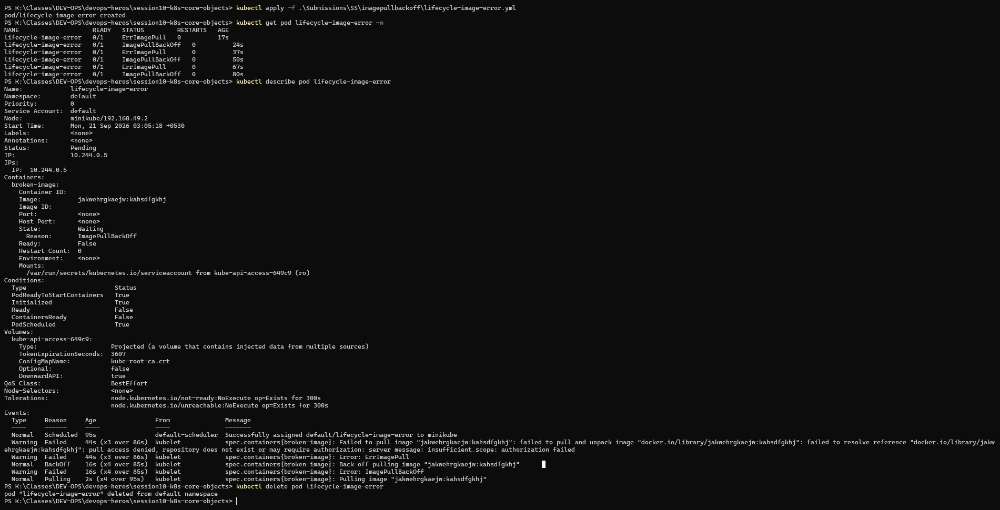

# Task 3 — ImagePullBackOff Error

## Why
Demonstrates the most common real-world Kubernetes failure — using a non-existent image tag causes kubelet to cycle through `ErrImagePull` → `ImagePullBackOff`.

## YAML File Used

```yaml
# lifecycle-image-error.yml
apiVersion: v1
kind: Pod
metadata:
  name: lifecycle-image-error
spec:
  restartPolicy: Never
  containers:
    - name: broken-image
      image: jakwehrgkaejw:kahsdfgkhj
```

## Commands Used

```powershell
kubectl apply -f .\Submissions\SS\imagepullbackoff\lifecycle-image-error.yml
kubectl get pod lifecycle-image-error -w
kubectl describe pod lifecycle-image-error
kubectl delete pod lifecycle-image-error
```

## What the Screenshot Shows

1. **Pod created** — starts in `ErrImagePull` after 17s
2. **Watch mode (`-w`)** — shows the pod cycling between:
   - `ErrImagePull` (retry failed)
   - `ImagePullBackOff` (backing off before next retry)
   - Ages: 29s, 37s, 50s, 67s, 80s — increasing backoff intervals
3. **`describe` output** reveals:
   - State: Waiting, Reason: `ImagePullBackOff`
   - Events show: `Failed to pull image "jakwehrgkaejw:kahsdfgkhj": pull access denied, repository does not exist`
   - kubelet keeps retrying with exponential backoff

## Key Takeaway
When a pod shows `ImagePullBackOff`, always run `kubectl describe pod <name>` to check the Events section — it tells you exactly why the image pull failed (wrong tag, wrong registry, auth issue, etc.).


