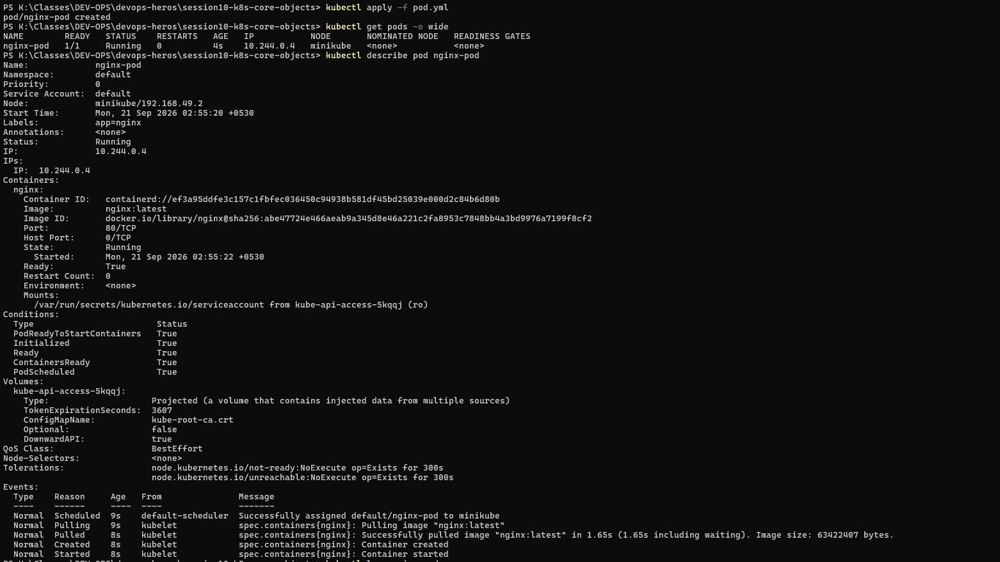
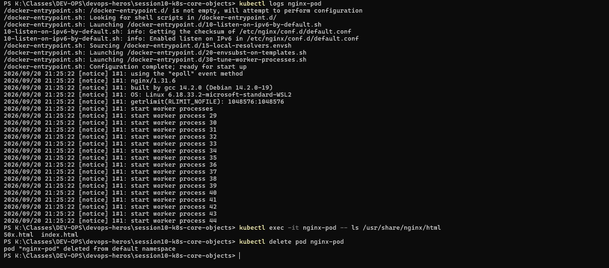

# Task 2 — Nginx Pod: Create / Inspect / Logs / Exec / Delete

## Why
Demonstrates the full CRUD lifecycle of a single pod — creating it, inspecting it in multiple ways, and cleaning up.

## Commands Used

```powershell
kubectl apply -f pod.yml
kubectl get pods -o wide
kubectl describe pod nginx-pod
kubectl logs nginx-pod
kubectl exec -it nginx-pod -- ls /usr/share/nginx/html
kubectl delete pod nginx-pod
```

## Screenshot 1 — Apply & Describe

- `kubectl apply -f pod.yml` creates the nginx pod
- `kubectl get pods -o wide` shows it Running with IP `10.244.0.4` on node `minikube`
- `kubectl describe pod nginx-pod` shows full details:
  - Image: `nginx:latest`
  - Port: 80/TCP
  - State: Running
  - Events: Scheduled → Pulling → Pulled → Created → Started

## Screenshot 2 — Logs, Exec & Delete

- `kubectl logs nginx-pod` shows nginx startup logs (worker processes 29–44)
- `kubectl exec -it nginx-pod -- ls /usr/share/nginx/html` lists files: `50x.html` and `index.html`
- `kubectl delete pod nginx-pod` removes the pod from the default namespace

## Key Takeaway
A pod is the smallest deployable unit. Use `describe` for events, `logs` for stdout, and `exec` to run commands inside the container.



