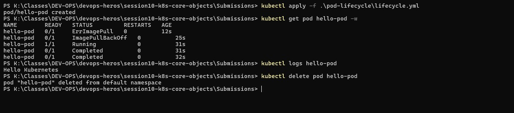

# Task 4 — Pod Lifecycle: ContainerCreating → Running → Completed

## Why
Shows the complete lifecycle of a short-lived pod — from creation through execution to completion.

## YAML File Used

```yaml
# lifecycle.yml
apiVersion: v1
kind: Pod
metadata:
  name: hello-pod
spec:
  restartPolicy: Never
  containers:
    - name: hello
      image: busybox:1.36
      command: ["sh", "-c", "echo Hello Kubernetes"]
```

## Commands Used

```powershell
kubectl apply -f .\pod-lifecycle\lifecycle.yml
kubectl get pod hello-pod -w
kubectl logs hello-pod
kubectl delete pod hello-pod
```

## What the Screenshot Shows

The watch mode (`-w`) captures every lifecycle transition:

| Time | Status | What's Happening |
|------|--------|-----------------|
| 12s | ErrImagePull | Initial image pull delay |
| 25s | ImagePullBackOff | Backing off before retry |
| 31s | Running | Container started, executing command |
| 31s | Completed | Command finished (exit 0) |
| 32s | Completed | Pod stays in Completed state |

- `kubectl logs hello-pod` outputs: **Hello Kubernetes**
- `kubectl delete pod hello-pod` removes the pod

## Key Takeaway
With `restartPolicy: Never`, a pod that exits successfully stays in `Completed` state and is never restarted. This is ideal for batch jobs and one-time tasks.


