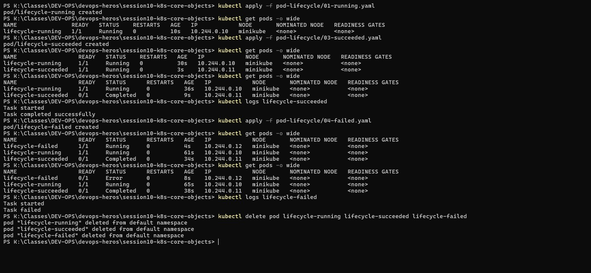
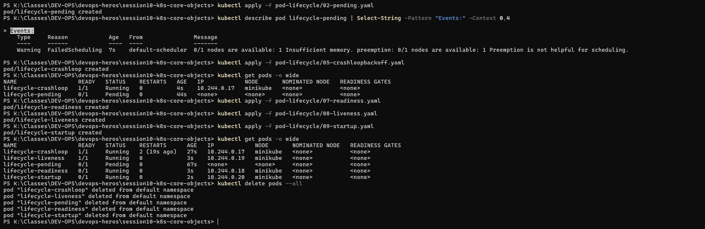
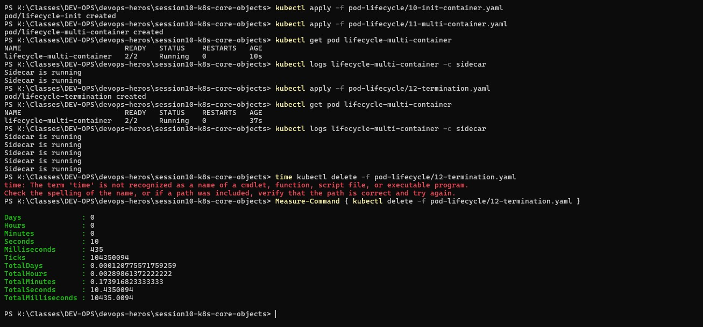

# Task 5 — Pod Lifecycle Deep Dive (5A, 5B, 5C)

## Why
Explores all major pod lifecycle states, probes, init containers, sidecars, and graceful termination.

---

## 5A — Basic States: Running / Succeeded / Failed

### Commands Used

```powershell
kubectl apply -f pod-lifecycle/01-running.yaml
kubectl apply -f pod-lifecycle/03-succeeded.yaml
kubectl apply -f pod-lifecycle/04-failed.yaml
kubectl get pods -o wide
kubectl logs lifecycle-succeeded
kubectl logs lifecycle-failed
kubectl delete pod lifecycle-running lifecycle-succeeded lifecycle-failed
```

### What the Screenshot Shows

- `lifecycle-running` — stays in **Running** state (1/1 READY)
- `lifecycle-succeeded` — transitions to **Completed** (exit 0)
  - Logs: "Task started" → "Task completed successfully"
- `lifecycle-failed` — transitions to **Error** (exit 1)
  - Logs: "Task started" → "Task failed"

---

## 5B — Pending, CrashLoopBackOff, Readiness & Liveness Probes

### Commands Used

```powershell
kubectl apply -f pod-lifecycle/02-pending.yaml
kubectl describe pod lifecycle-pending | Select-String -Pattern "Events:" -Context 0,4
kubectl apply -f pod-lifecycle/05-crashloopbackoff.yaml
kubectl apply -f pod-lifecycle/07-readiness.yaml
kubectl apply -f pod-lifecycle/08-liveness.yaml
kubectl apply -f pod-lifecycle/09-startup.yaml
kubectl get pods -o wide
kubectl delete pods --all
```

### What the Screenshot Shows

- `lifecycle-pending` — stuck in **Pending** (0/1 READY, no IP)
  - Events: `FailedScheduling` — "Insufficient memory. preemption: 0/1 nodes are available"
- `lifecycle-crashloop` — **Running** but with 2 restarts (19s ago) — CrashLoopBackOff
- `lifecycle-readiness` — **Running** 0/1 READY (probe warming up, not yet ready)
- `lifecycle-liveness` — **Running** 1/1 READY (liveness probe passed)
- `lifecycle-startup` — **Running** 0/1 READY (startup probe in progress)

---

## 5C — Init Container, Multi-Container Sidecar & Graceful Termination

### Commands Used

```powershell
kubectl apply -f pod-lifecycle/10-init-container.yaml
kubectl apply -f pod-lifecycle/11-multi-container.yaml
kubectl get pod lifecycle-multi-container
kubectl logs lifecycle-multi-container -c sidecar
kubectl apply -f pod-lifecycle/12-termination.yaml
Measure-Command { kubectl delete -f pod-lifecycle/12-termination.yaml }
```

### What the Screenshot Shows

- `lifecycle-multi-container` — **2/2 Running** (both app + sidecar containers ready)
- Sidecar logs: "Sidecar is running" (repeated)
- `Measure-Command` shows **10.435 seconds** for deletion — demonstrating graceful termination with a SIGTERM trap and 20s `terminationGracePeriodSeconds`

---

## Key Takeaway

| State | Meaning |
|-------|---------|
| **Pending** | Cannot be scheduled (resource constraints or no matching node) |
| **Running** | Container is executing |
| **Completed/Success** | Process exited with code 0 |
| **Error/Failed** | Process exited with non-zero code |
| **CrashLoopBackOff** | Container keeps crashing and restarting with increasing backoff |
| **ErrImagePull** | Image cannot be pulled from registry |




