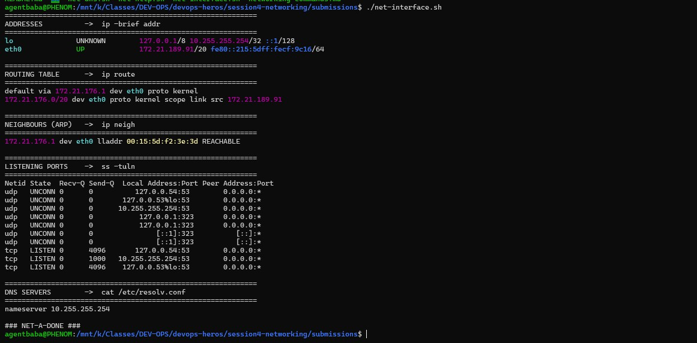
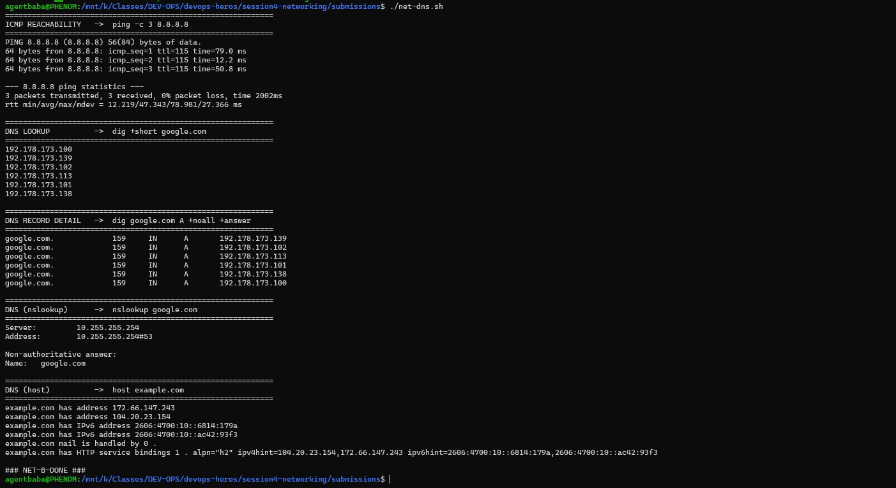
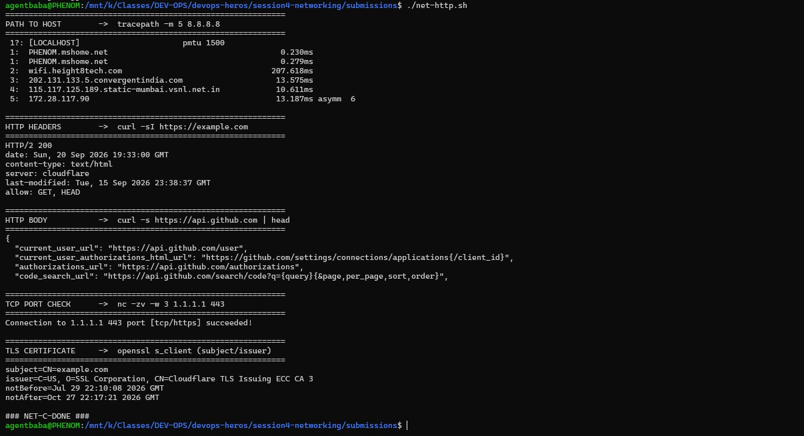

# Networking Homework — Session 4

Three shell scripts that demonstrate core networking commands, with real terminal output and DevOps-relevant explanations.

---

## Scripts

| Script | Covers |
|---|---|
| [`net-interface.sh`](net-interface.sh) | Interfaces, routing, ARP, sockets, DNS servers |
| [`net-dns.sh`](net-dns.sh) | Ping reachability, DNS lookups (dig, nslookup, host) |
| [`net-http.sh`](net-http.sh) | Path tracing, HTTP headers/body, TCP port check, TLS cert |

### How to run

```bash
# Install required tools (Ubuntu/Debian)
sudo apt update && sudo apt install -y traceroute netcat-openbsd dnsutils

# Make scripts executable
chmod +x net-interface.sh net-dns.sh net-http.sh

# Run each script
./net-interface.sh
./net-dns.sh
./net-http.sh
```

---

## Task 2 — Command Executions & Explanations

### Script 1: `net-interface.sh` — Interfaces, Routes, Neighbours, Sockets

| Command | Purpose |
|---|---|
| `ip -brief addr` | List all network interfaces and their IP addresses |
| `ip route` | Show the kernel routing table |
| `ip neigh` | Display the ARP/ neighbour cache (IP to MAC mappings) |
| `ss -tuln` | List listening TCP/UDP sockets |
| `grep /etc/resolv.conf` | Show configured DNS nameservers |

**Key takeaway:** `ip` replaces `ifconfig`, `ss` replaces `netstat`, and `ip neigh` replaces `arp -a`. All part of the `iproute2` suite.

---

### Script 2: `net-dns.sh` — Reachability & DNS

| Command | Purpose |
|---|---|
| `ping -c 3 8.8.8.8` | Test ICMP reachability and round-trip time |
| `dig +short google.com` | Quick DNS lookup — returns just the IP |
| `dig google.com A +noall +answer` | Detailed DNS answer with TTL |
| `nslookup google.com` | Simple DNS query (older tool) |
| `host example.com` | Quick multi-record DNS lookup (A, AAAA, MX) |

**Key takeaway:** `dig` is the go-to DNS troubleshooting tool. `ping` to an IP tests network path; `ping` to a name also tests DNS resolution.

---

### Script 3: `net-http.sh` — Path, HTTP, TCP Port Checks

| Command | Purpose |
|---|---|
| `tracepath -m 5 8.8.8.8` | Trace packet path and discover path MTU (no root needed) |
| `curl -sI https://example.com` | Fetch HTTP headers only (HEAD request) |
| `curl -s https://api.github.com` | Fetch HTTP body (test REST API) |
| `nc -zv -w 3 1.1.1.1 443` | Check if a TCP port is open |
| `openssl s_client` | Inspect TLS certificate (subject, issuer, expiry) |

**Key takeaway:** `tracepath` is an unprivileged alternative to `traceroute`. `nc` is essential for firewall and port troubleshooting. `openssl s_client` debugs TLS/HTTPS issues.

---

## Required Packages

On Ubuntu/Debian WSL, install these before running the scripts:

```bash
sudo apt install -y traceroute netcat-openbsd dnsutils
```

| Package | Provides |
|---|---|
| `traceroute` | `tracepath`, `traceroute` |
| `netcat-openbsd` | `nc` (netcat) |
| `dnsutils` | `dig`, `nslookup`, `host` |

---

## Modern Replacements

| Older command | Modern replacement | Why |
|---|---|---|
| `ifconfig` | `ip -brief addr` | `ifconfig` is deprecated (net-tools) |
| `netstat -tulnp` | `ss -tulnp` | `ss` is faster, uses netlink |
| `arp -a` | `ip neigh` | part of iproute2 |
| `route -n` | `ip route` | part of iproute2 |
| `traceroute` | `tracepath` | no root needed, discovers PMTU |

---

## Task 1 — Practice Repos

GitHub resources for networking practice (Nency Ravaliya):
- [Networking](https://github.com/Nency-Ravaliya/Networking)
- [Network-Troubleshooting](https://github.com/Nency-Ravaliya/Network-Troubleshooting)
- [OSI-Network-devices](https://github.com/Nency-Ravaliya/OSI-Network-devices)
- [Subnetting](https://github.com/Nency-Ravaliya/Subnetting)
- [IP-quest](https://github.com/Nency-Ravaliya/IP-quest)
- [How-DHCP-Works](https://github.com/Nency-Ravaliya/How-DHCP-Works)
- [IPFIX-NETFLOW-NTP](https://github.com/Nency-Ravaliya/IPFIX-NETFLOW-NTP)

---

## Screenshots




