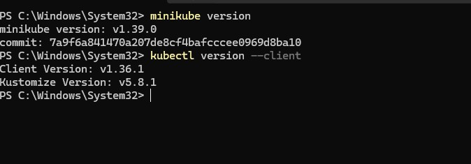
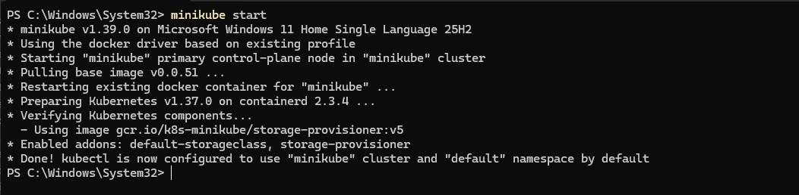
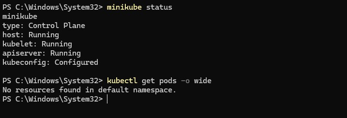
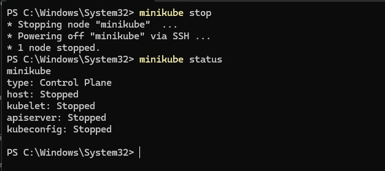

# Session 9: Kubernetes Fundamentals & Cluster Architecture

**Course:** SST DevOps & Cloud [SWE]
**Session:** 09 - Kubernetes Fundamentals
**Repository:** devops-heros / session9-k8s

---

## Task 1: Minikube & CLI Installation Verification

Verify that Minikube and the Kubernetes CLI (`kubectl`) are successfully installed on the local system.

**Command:**

```bash
minikube version
kubectl version --client
```

**Output:**

```
minikube version: v1.38.1
commit: c93a4cb9311efc66b90d33ea03f75f2c4120e9b0-dirty

Client Version: v1.36.4
Kustomize Version: v5.8.1
```

**Screenshot:**



---

## Task 2: Starting the Minikube Kubernetes Cluster

Initialize the local single-node Kubernetes cluster using the containerized Docker runtime environment.

**Command:**

```bash
minikube start
```

**Output:**

```
* minikube v1.38.1 on Omarchy 4.0.3
* Using the docker driver based on existing profile
* Starting "minikube" primary control-plane node in "minikube" cluster
* Pulling base image v0.0.50 ...
* Verifying Kubernetes components...
  - Using image gcr.io/k8s-minikube/storage-provisioner:v5
* Enabled addons: storage-provisioner, default-storageclass
* Done! kubectl is now configured to use "minikube" cluster and "default" namespace by default
```

**Screenshot:**



---

## Task 3: Verifying Cluster Status & Node Health

Inspect the status of the local cluster control plane, kubelet, API server, and verify the node is in `Ready` state.

**Commands:**

```bash
minikube status
kubectl get nodes -o wide
```

**Output:**

```
minikube
type: Control Plane
host: Running
kubelet: Running
apiserver: Running
kubeconfig: Configured

NAME       STATUS   ROLES           AGE   VERSION   INTERNAL-IP    EXTERNAL-IP   OS-IMAGE                         KERNEL-VERSION   CONTAINER-RUNTIME
minikube   Ready    control-plane   10d   v1.35.1   192.168.49.2   <none>        Debian GNU/Linux 12 (bookworm)   7.2.3-arch1-3    docker://29.2.1
```

**Screenshot:**



---

## Task 4: Stopping the Minikube Cluster

Gracefully power down the Minikube cluster VM/container to release system resources.

**Command:**

```bash
minikube stop
minikube status
```

**Output:**

```
* Stopping node "minikube"  ...
* Powering off "minikube" via SSH ...
* 1 node stopped.

minikube
type: Control Plane
host: Stopped
kubelet: Stopped
apiserver: Stopped
kubeconfig: Stopped
```

**Screenshot:**



---

## Resources

- https://kubernetes.io/docs/tutorials/kubernetes-basics/
- https://minikube.sigs.k8s.io/docs/start/
- https://kubernetes.io/docs/concepts/architecture/
